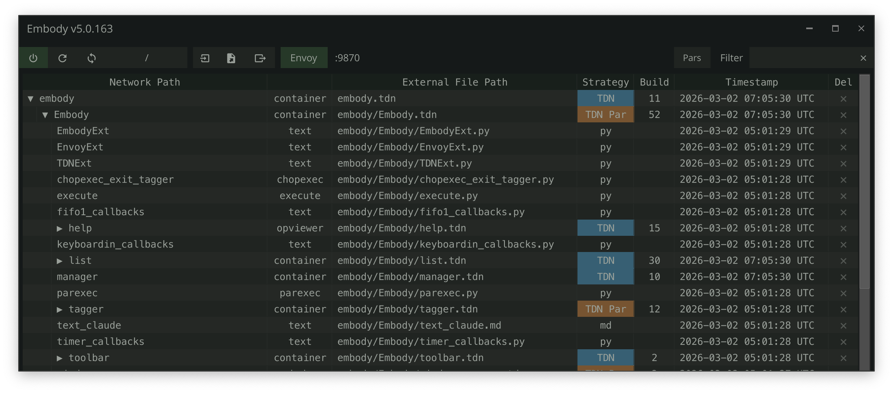

# 💬 Embody

**Create at the speed of thought.**


[Full Documentation](https://dylanroscover.github.io/Embody/) &nbsp;|&nbsp; [Manifesto](https://dylanroscover.github.io/Embody/manifesto/) &nbsp;|&nbsp; [Changelog](https://dylanroscover.github.io/Embody/changelog/)

---

Embody puts your ideas on screen as fast as you can describe them. Operators, connections, parameters, the works. Want to try a different direction? Spin up a new approach in seconds. Compare attempts side by side. Branch off the one that works. **The tool keeps up with you, instead of the other way around.**

## Three Tools, One Idea

**Envoy** — *forward velocity.* An embedded [MCP](https://modelcontextprotocol.io/) server lets [Claude Code](https://docs.anthropic.com/en/docs/claude-code), [Cursor](https://www.cursor.com/), and [Windsurf](https://windsurf.com/) talk directly to your live TouchDesigner session. Create operators, wire them up, set parameters, write extensions, debug errors — by saying what you want. No copy-pasting code. No describing your network in chat. Idea → operators in seconds.

**Embody** — *lateral velocity.* Tag any operator and Embody externalizes it to files on disk that mirror your network hierarchy. Try a new direction, branch off a good one, restore the state from yesterday — all in seconds. Your externalized files are the source of truth, so every project opens already in flow.

**TDN** — *the substrate that makes both possible.* TouchDesigner networks exported as human-readable JSON. The format is what lets your AI agent understand what's on the screen, what lets you diff one attempt against another, and what lets a network reconstruct itself from text on the next project open. TDN is what makes the rest of this possible.



| | What | Why it matters |
|---|---|---|
| 🤖 | **Envoy MCP Server** | 46 tools let your AI assistant build, wire, parameterize, and debug live networks. The first time you watch it happen, you stop typing operator names by hand for good. |
| 📄 | **TDN Network Format** | Networks become text. Diff two versions, revisit any version, hand an LLM a complete picture of what's on screen — all from a single `.tdn` file. |
| 📦 | **Automatic Restoration** | Externalized operators rebuild themselves from disk on every project open. The `.toe` is no longer the source of truth — your files are. |
| 📤 | **Portable Tox Export** | Pull any COMP out as a self-contained `.tox` with external references stripped. Ship a piece of your project anywhere. |

---

## Quick Start

### 1. Project Setup

Embody writes externalized files relative to your `.toe` location — no special folder structure required. Embody works in any project folder; if you happen to use git, every change is also a clean diff for free.

```
my-project/              ← project folder (optionally a git repo)
├── my-project.toe       ← your TouchDesigner project
├── base1/               ← externalized operators
│   ├── base2.tox        ← COMP (TOX strategy)
│   ├── base3.tdn        ← COMP (TDN strategy — diffable JSON)
│   └── text1.py         ← DAT
└── ...
```

### 2. Install and Tag

1. **Download** the Embody `.tox` from [`/release`](release/) and drag it into your TouchDesigner project
2. **Tag operators** — select any COMP or DAT and press `lctrl` twice to tag and externalize it
3. **Work normally** — press `ctrl + shift + u` to update all externalizations, or `ctrl + alt + u` to update only the current COMP. On project open, Embody restores everything from disk automatically

> **Tip:** If no operators are tagged, Embody will externalize all eligible COMPs and DATs, which may slow down complex projects. Tagging selectively is recommended.

### 3. Keyboard Shortcuts

| Shortcut | Action |
|----------|--------|
| `lctrl + lctrl` | Tag or manage the operator under the cursor |
| `ctrl + shift + u` | Update all externalizations |
| `ctrl + alt + u` | Update only the current COMP |
| `ctrl + shift + r` | Refresh tracking state |
| `ctrl + shift + o` | Open the Manager UI |
| `ctrl + shift + e` | Export entire project to `.tdn` file |
| `ctrl + alt + e` | Export current COMP to `.tdn` file |

For supported formats, folder configuration, duplicate handling, Manager UI, and more — see the [Embody docs](https://dylanroscover.github.io/Embody/embody/).

---

## Envoy MCP Server

Embody includes **Envoy**, an embedded [MCP](https://modelcontextprotocol.io/) server that gives AI coding assistants direct access to your live TouchDesigner session.

### Setup

1. **Enable Envoy** — toggle the `Envoyenable` parameter on the Embody COMP
2. **Server starts** on `localhost:9870` (configurable via `Envoyport`)
3. **Auto-configuration** — Envoy creates a `.mcp.json` in your git repo root
4. **Connect** — open a Claude Code session (or restart your IDE) in the repo root — it picks up `.mcp.json` automatically

If your project isn't in a git repo, add `.mcp.json` manually to your project root:

```json
{
  "mcpServers": {
    "envoy": {
      "type": "http",
      "url": "http://localhost:9870/mcp"
    }
  }
}
```

### Tools at a Glance

| Tool | What It Does |
|------|-------------|
| `create_op` | Create any operator type in any network |
| `set_parameter` | Set values, expressions, or bind modes on any parameter |
| `connect_ops` | Wire operators together |
| `execute_python` | Run arbitrary Python in TD's main thread |
| `export_network` | Export networks to diffable `.tdn` JSON |
| `create_extension` | Scaffold a full extension (COMP + DAT + wiring) |
| `get_op_errors` | Inspect errors on any operator and its children |

...and 37 more. See the [full tools reference](https://dylanroscover.github.io/Embody/envoy/tools-reference/).

When Envoy starts, it generates a `CLAUDE.md` file in your project root with TD development patterns, the complete MCP tool reference, and project-specific guidance.

---

## TDN Network Format

TDN (TouchDesigner Network) is the file format that makes the rest of Embody possible. It exports an entire operator network — operators, connections, parameters, layout, annotations, DAT content — as a single human-readable JSON file. Your AI agent can read it. You can read it. Any text tool can diff it. The network can rebuild itself from it on the next project open.

This is the substrate. Every other capability — AI-driven building, version control, automatic restoration — builds on top of it.

- **Entire project**: `ctrl + shift + e`
- **Current COMP**: `ctrl + alt + e`
- **Via Envoy**: `export_network` / `import_network` MCP tools

See the [full TDN specification](https://dylanroscover.github.io/Embody/tdn/specification/) for format details, import process, and round-trip guarantees.

---

<details>
<summary><strong>Logging</strong></summary>

Embody provides a multi-destination logging system:

- **File logging** (default): `dev/logs/<project_name>_YYMMDD.log`, auto-rotates at 10 MB
- **FIFO DAT**: Recent entries visible in the TD network editor
- **Textport**: Enable the `Print` parameter to echo logs
- **Ring buffer**: Last 200 entries via the Envoy `get_logs` MCP tool

```python
op.Embody.Log('Something happened', 'INFO')
op.Embody.Warn('Check this out')
op.Embody.Error('Something broke')
```

</details>

<details>
<summary><strong>Testing</strong></summary>

Embody includes **41 test suites** covering core externalization, MCP tools, TDN format, and server lifecycle. Tests run inside TouchDesigner using a custom test runner with sandbox isolation.

```python
op.unit_tests.RunTests()                              # All tests (non-blocking)
op.unit_tests.RunTests(suite_name='test_path_utils')   # Single suite
op.unit_tests.RunTestsSync()                           # All in one frame (blocks TD)
```

Via Envoy MCP: use the `run_tests` tool. See the [full testing docs](https://dylanroscover.github.io/Embody/testing/) for coverage details and how to write new tests.

</details>

<details>
<summary><strong>Troubleshooting</strong></summary>

- **Timeline Paused**: Embody requires the timeline to be running. An error appears if paused.
- **Clone/Replicant Operators**: Cannot be externalized. Embody warns if you try to tag them.
- **Engine COMPs**: Engine, time, and annotate COMPs are not supported for externalization.

For more, see [Troubleshooting](https://dylanroscover.github.io/Embody/embody/troubleshooting/).

</details>

---

## Version History

See the [full changelog](https://dylanroscover.github.io/Embody/changelog/) for detailed version history.

**Recent releases:**

- **5.0.354**: Consolidate runtime files into `.embody/` folder, fix bridge path resolution
- **5.0.352**: Fix Envoy failing to start after Embody upgrade (restart counter, port race, reclaim timeout)
- **5.0.351**: Creation-defaults catalog, stdin-based bridge lifecycle, Envoy resilience hardening
- **5.0.336**: Batch MCP operations, Envoy auto-restart on crash and save, 46 MCP tools
- **5.0.330**: Envoy bridge v2 — proactive reconciliation, multi-session safety, zero forced restarts
- **5.0.320**: TDN v1.3 — parameter sequence round-trip + companion DAT handling (GLSL/Timer/Script/Ramp companions)
- **5.0.310**: Fix first-time Envoy setup stuck on "Disabled" (issues #8, #9), git config generation on fresh install
- **5.0.305**: Replicant duplicate detection fix (issue #4), TDN export improvements, ExternalizeProject dialog
- **5.0.302**: Fix duplicate path clone detection (issue #4), config file location (issue #5), Envoy startup flow
- **5.0.278**: Fix folder change crash (issue #3), regression tests
- **5.0.277**: Manager UI improvements, Ctrl+Shift+R shortcut, consistent "Update" terminology
- **5.0.275**: TDN export keyboard shortcut pars, keyboard shortcuts documentation
- **5.0.274**: Settings persistence across upgrades, extension initialization timing docs
- **5.0.263**: DAT content safety, palette clone fidelity, recursive TDN fingerprinting, venv validation
- **5.0.259**: Mandatory operator layout rules, `/local` path prohibition, TD connectivity recovery
- **5.0.258**: Multi-instance Envoy support, `switch_instance` tool, auto-suffix collision avoidance
- **5.0.252**: Windows process-kill fix, reconstruction verification fix
- **5.0.251**: Nested TDN child-skip on import, depth-sorted reconstruction ordering
- **5.0.243**: Headless smoke testing, file cleanup preferences, specialized COMP support, portable .tox hardening
- **5.0.237**: TDN v1.1 format, import error surfacing, save-cycle pane restoration, Envoy troubleshooting docs
- **5.0.235**: `restart_td` meta-tool, local MCP handshake, operator overlap warnings
- **5.0.233**: Project-level performance monitoring, `/validate` command, test runner dialog fix
- **5.0.228**: macOS timezone fix, toolbar hover highlight
- **5.0.227**: TDN crash safety — atomic writes, backup rotation, content-equal skip, About page filtering
- **5.0.222**: Rename `tag_for_externalization` → `externalize_op`, clarify single-step workflow
- **5.0.221**: TDN annotation properties, GitHub release rule, templates cleanup
- **5.0.220**: Network layout rewrite, commit-push checklist rule, expanded MCP tool allowlist, tooltip fix
- **5.0.217**: TDN target COMP parameter preservation, user-prompted file cleanup, dock safety, git init hardening
- **5.0.210**: DAT restoration on startup, continuity check hardening, manager list row limiting
- **5.0.208**: Settings auto-deploy, bridge template, Envoy startup resilience
- **5.0.206**: Metadata reconciliation, network layout tool, TDN companion dedup
- **5.0.204**: Custom window header, path portability, TDN cleanup
- **5.0.201**: Robust first-install init, table schema expansion, release build hardening
- **5.0.190**: Automatic restoration — TOX and TDN strategy COMPs fully restored from disk on project open
- **5.0**: Envoy MCP server (46 tools), TDN format, test framework (38 suites), macOS support

---

## Contributors

Originally derived from [External Tox Saver](https://github.com/franklin113/External-Tox-Saver) by [Tim Franklin](https://github.com/franklin113/). Refactored entirely by Dylan Roscover, with inspiration and guidance from Elburz Sorkhabi, Matthew Ragan and Wieland Hilker.

## License

[MIT License](LICENSE)
