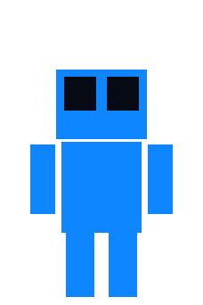

<div align="center">


# Embody

**create at the speed of thought.**

[](https://github.com/dylanroscover/Embody/releases/latest)
[](https://derivative.ca/)
[](https://modelcontextprotocol.io/)
[](LICENSE)
[](https://github.com/dylanroscover/Embody/stargazers)
[](https://github.com/dylanroscover/Embody/releases)

[**embody.tools**](https://embody.tools) &nbsp;&middot;&nbsp; [Documentation](https://dylanroscover.github.io/Embody/) &nbsp;&middot;&nbsp; [Manifesto](https://dylanroscover.github.io/Embody/manifesto/) &nbsp;&middot;&nbsp; [Changelog](https://dylanroscover.github.io/Embody/changelog/)



<sub>**Embot** — he hops through your network while Envoy builds</sub>

</div>

---

Embody puts your ideas on screen as fast as you can describe them. Operators, connections, parameters, the works. Want to try a different direction? Spin up a new approach in seconds. Compare attempts side by side. Branch off the one that works. **The tool keeps up with you, instead of the other way around.**

## Four Tools, One Idea

**[Envoy](https://dylanroscover.github.io/Embody/envoy/)** — *forward velocity.* An embedded [MCP](https://modelcontextprotocol.io/) server lets [Claude Code](https://docs.anthropic.com/en/docs/claude-code), [Codex](https://github.com/openai/codex), [OpenCode](https://opencode.ai/), [Gemini](https://github.com/google-gemini/gemini-cli), [Cursor](https://www.cursor.com/), [Windsurf](https://windsurf.com/), and [GitHub Copilot](https://github.com/features/copilot) (via VS Code) talk directly to your live TouchDesigner session. Create operators, wire them up, set parameters, write extensions, debug errors — by saying what you want. No copy-pasting code. No describing your network in chat. Idea → operators in seconds.

**Embody** — *lateral velocity.* Tag any operator and Embody [externalizes it](https://dylanroscover.github.io/Embody/embody/getting-started/) to files on disk that mirror your network hierarchy. Try a new direction, branch off a good one, restore the state from yesterday — all in seconds. Your externalized files are the source of truth, so every project opens already in flow.

**Convoy** — *outward velocity.* Convoy-enabled Embody nodes on a trusted LAN discover, inspect, and control each other — one AI session relaying builds, test runs, saves, screenshots, and restarts to every machine in the room. A small per-user background app keeps each node reachable even while TouchDesigner is closed. [Convoy guide](https://dylanroscover.github.io/Embody/convoy/)

**[TDXN](https://dylanroscover.github.io/Embody/tdxn/)** — *the substrate that makes it all possible.* TouchDesigner networks exported as human-readable YAML. The format is what lets your AI agent understand what's on the screen, what lets you diff one attempt against another, and what lets a network reconstruct itself from text on the next project open. TDXN is what makes the rest of this possible.


| | What | Why it matters |
|---|---|---|
| 🤖 | **Envoy MCP Server** | 65 tools let your AI assistant build, wire, parameterize, and debug live networks. The first time you watch it happen, you stop typing operator names by hand for good. |
| 📄 | **TDXN Network Format** | Networks become text. Diff two versions, revisit any version, hand an LLM a complete picture of what's on screen — all from a single `.tdxn` file. |
| 📦 | **Automatic Restoration** | Externalized files are written on save, so any COMP can be recovered from disk. By default (Export-on-Save) the `.toe` stays authoritative on open; switch to Roundtrip mode to rebuild TDXN-strategy COMPs from `.tdxn` on every open. |
| 📤 | **Portable Tox Export** | Pull any COMP out as a self-contained `.tox` with external references stripped. Ship a piece of your project anywhere. |
| 🐍 | **Project Python Environment** | One `.venv` per project, built against TouchDesigner's own interpreter — Envoy runs from it, your packages import inside TD from it, and AI agents manage it hands-free. [Python Environment](https://dylanroscover.github.io/Embody/embody/python-environment/) |
| 🛰️ | **Convoy LAN Relay** | Convoy-enabled Embody nodes on a trusted LAN discover, inspect, and control each other through Envoy — relay test runs, saves, screenshots, and restarts to other machines from one AI session. [Convoy guide](https://dylanroscover.github.io/Embody/convoy/) |

---

## Quick Start

**Requirements:** TouchDesigner **2025.33070 or later** (Windows / macOS). No Python setup needed — Embody builds a per-project Python environment (`.venv`) matched to TouchDesigner's own interpreter, and [your own packages can live in it too](https://dylanroscover.github.io/Embody/embody/python-environment/). No special folder structure either: Embody works in any project folder, and if you happen to use git, every change is also a clean diff for free.

### 1. Install

**Download** the Embody `.tox` from [`/release`](release/) and drag it into your TouchDesigner project. The **[Setup Wizard](https://dylanroscover.github.io/Embody/embody/setup-wizard/)** opens and walks you through the choices that matter — how much autonomy Embody gets, what to externalize, whether to enable the AI assistant (Envoy) and for which tool, permissions, whether to join a trusted-LAN Convoy, and where config files live. Nothing changes until the final click, and you can re-run it anytime via the **Setup Wizard** pulse on the Embody COMP.

> **Updating Embody:** Embody updates itself — pulse **Check for Update** on the About page (or set **Auto-Update** to check at startup), and a verified release is downloaded, backed up against, and swapped in place. Your settings and tracked externalizations live on disk and survive the update untouched. See the [auto-update guide](https://dylanroscover.github.io/Embody/embody/auto-update/). Manual alternative: delete the old Embody COMP and drag the new `.tox` in its place — the new version picks up your on-disk state automatically, no re-scan, no files rewritten.

### 2. Tag and Work

1. **Tag operators** — hover any COMP or DAT and press `lctrl` twice to open the tagger (pick a strategy for a COMP, a file format for a DAT)
2. **Work normally** — press `ctrl + shift + u` to update all externalizations, or `ctrl + alt + u` to update only the current COMP. Externalized files are written on save; on open, the `.toe` stays authoritative by default (Export-on-Save), while Roundtrip mode also reconstructs TDXN-strategy COMPs from disk

> **Tip:** Externalization is opt-in — nothing is written to disk until you tag it. To capture your AI assistant's work automatically, set **Auto-Externalize New Ops** (Envoy parameter page) and everything it creates through Envoy is tagged and externalized as it's built.

For supported formats, folder configuration, duplicate handling, Manager UI, and more — see the [Embody docs](https://dylanroscover.github.io/Embody/embody/).

---

## Envoy MCP Server

Embody includes **Envoy**, an embedded [MCP](https://modelcontextprotocol.io/) server that gives AI coding assistants direct access to your live TouchDesigner session.

### Setup

1. **Pick an AI assistant in the [Setup Wizard](https://dylanroscover.github.io/Embody/embody/setup-wizard/)** — it opens on first install, or re-run it anytime (the **Setup Wizard** pulse on the Embody COMP). Prefer parameters? Toggling **Envoy Enable** (`Envoyenable`) does the same thing with your current settings
2. **Server starts** on `127.0.0.1:9870` (configurable via `Envoyport`; if the port is taken by another instance, Envoy scans forward automatically)
3. **Auto-configuration** — Envoy writes a `.mcp.json` (STDIO bridge, so tools are available even before TD is running) at your AI project root. By default that's the git repo root; the wizard's config-location step — or the `Aiprojectroot` parameter — can point it at the `.toe` folder or a custom path instead. Projects without a git repo still get config generated in the `.toe` folder
4. **Connect** — open a Claude Code session (or restart your IDE) at that root — it picks up `.mcp.json` automatically

The generated config runs Envoy's bridged STDIO transport (recommended — it can launch and restart TD for you). If you'd rather wire a client by hand, the direct HTTP transport works whenever TD is running:

```json
{
  "mcpServers": {
    "envoy": {
      "type": "http",
      "url": "http://127.0.0.1:9870/mcp"
    }
  }
}
```

### Tools at a Glance

| Tool | What It Does |
|------|-------------|
| `create_op` | Create any operator type in any network |
| `set_parameter` | Set values, expressions, or bind modes on any parameter |
| `connect_ops` | Wire operators together |
| `execute_python` | Run arbitrary Python in TD's main thread |
| `export_network` | Export networks to diffable `.tdxn` YAML |
| `create_extension` | Scaffold a full extension (COMP + DAT + wiring) |
| `get_op_errors` | Inspect errors on any operator and its children |

...and 56 more. See the [full tools reference](https://dylanroscover.github.io/Embody/envoy/tools-reference/).

When Envoy starts, it always generates an `AGENTS.md` file in your project root with TD development patterns and project-specific guidance. It also writes a client-specific config for whichever assistant you select in the `Aiclient` parameter (`CLAUDE.md` + `.claude/` for Claude Code, `opencode.json` + `.claude/` for OpenCode, Cursor/Windsurf rules, Copilot instructions, `GEMINI.md` for Gemini; Codex and OpenCode read `AGENTS.md` directly). For OpenCode and local-model setups, see the [Local Models & Open Clients](https://dylanroscover.github.io/Embody/envoy/local-models/) guide.

---

## TDXN Network Format

TDXN (TouchDesigner eXternal Network) is the file format that makes the rest of Embody possible. It exports an entire operator network — operators, connections, parameters, layout, annotations, DAT content — as a single human-readable YAML file. Your AI agent can read it. You can read it. Any text tool can diff it. The network can rebuild itself from it.

This is the substrate. Every other capability — AI-driven building, version control, automatic restoration — builds on top of it.

- **Entire project**: `ctrl + shift + e`
- **Current COMP**: `ctrl + alt + e`
- **Via Envoy**: `export_network` / `import_network` MCP tools

See the [full TDXN specification](https://dylanroscover.github.io/Embody/tdxn/specification/) for format details, import process, and round-trip guarantees.

---

## Keyboard Shortcuts

| Shortcut | Action |
|----------|--------|
| `lctrl + lctrl` | Tag or manage the operator under the cursor |
| `ctrl + shift + u` | Update all externalizations |
| `ctrl + alt + u` | Update only the current COMP |
| `ctrl + shift + r` | Refresh tracking state |
| `ctrl + shift + o` | Open the Manager UI |
| `ctrl + shift + c` | Copy the selected COMP to the clipboard as a portable TDXN envelope |
| `ctrl + shift + e` | Export entire project to `.tdxn` file |
| `ctrl + alt + e` | Export current COMP to `.tdxn` file |

These are the defaults — every shortcut is editable on the Embody COMP's **Shortcuts** parameter page (type a combo, or pulse **Record** and press the keys; empty disables it). See [Keyboard Shortcuts](https://dylanroscover.github.io/Embody/embody/keyboard-shortcuts/).

---

<details>
<summary><strong>Where externalized files go</strong></summary>

Embody writes externalized files relative to your `.toe` location, mirroring your network hierarchy — no special folder structure required:

```
my-project/              ← project folder (optionally a git repo)
├── my-project.toe       ← your TouchDesigner project
├── base1/               ← externalized operators
│   ├── base2.tox        ← COMP (TOX strategy)
│   ├── base3.tdxn        ← COMP (TDXN strategy — diffable YAML)
│   └── text1.py         ← DAT
└── ...
```

</details>

<details>
<summary><strong>Logging</strong></summary>

Embody provides a multi-destination logging system:

- **File logging** (default): `dev/logs/<project_name>_YYMMDD.log`, auto-rotates at 10 MB
- **FIFO DAT**: Recent entries visible in the TD network editor
- **Textport**: Enable the `Print` parameter to echo logs
- **Ring buffer**: Last 200 entries via the Envoy `get_logs` MCP tool

```python
op.Embody.Log('Something happened', 'INFO')
op.Embody.Warn('Check this out')
op.Embody.Error('Something broke')
```

</details>

<details>
<summary><strong>Testing</strong></summary>

Embody includes **140 test suites** (4,256 tests) covering core externalization, MCP tools, TDXN format, the Envoy server/bridge, launch/config generation, install/uninstall paths, self-update, release hooks, the status readout, and palette catalogs. Tests run inside TouchDesigner using a custom test runner with sandbox isolation. Destructive whole-project suites are segregated and run only via the save-gated `RunDestructiveTests`.

```python
op.unit_tests.RunTests()                              # All tests (non-blocking)
op.unit_tests.RunTests(suite_name='test_path_utils')   # Single suite
op.unit_tests.RunTestsSync()                           # All in one frame (blocks TD)
```

Via Envoy MCP: use the `run_tests` tool. See the [full testing docs](https://dylanroscover.github.io/Embody/testing/) for coverage details and how to write new tests.

</details>

<details>
<summary><strong>Troubleshooting</strong></summary>

- **Timeline Paused**: Embody requires the timeline to be running. An error appears if paused.
- **Clone/Replicant Operators**: Cannot be externalized. Embody warns if you try to tag them.
- **Engine COMPs**: Engine, time, and annotate COMPs are not supported for externalization.

For more, see [Troubleshooting](https://dylanroscover.github.io/Embody/embody/troubleshooting/).

</details>

---

## Version History

Every release is documented in the [full changelog](https://dylanroscover.github.io/Embody/changelog/). Highlights:

- **6.2.8** — the TDXN rename completes across docs, skills, and embody.tools (`/tdn/` → `/tdxn/` with permanent redirects)
- **6.2.5** — TDXN review fixes: snapshot exports never touch tracked files, and dirty detection covers everything an export writes
- **6.2.0** — three namespace tiers; the promoted surface drops from 214 members to 43 (issue #94 — **breaking** for undocumented names)
- **6.1.5** — every AI client gets the MCP config it actually reads, from one registry; edit protection rides inside generated files
- **6.1.2** — the format becomes **TDXN** (TouchDesigner eXternal Network); existing `.tdn` files work unchanged, with an opt-in migration pulse
- **6.0.201–6.0.280** — the Convoy hardening arc: macOS enablement, a self-updating daemon, fleet-wide Embody updates, and a self-updater that can no longer be latched by a stuck download
- **6.0.171** — Convoy ships end to end: nodes on a trusted LAN discover, relay work to, and control each other
- **6.0.162** — MCP SDK 2.0 port with self-upgrading venvs
- **6.0.145** — self-update ships: manifest-gated, verified, backup + rollback
---

## Contributors

Originally derived from [External Tox Saver](https://github.com/franklin113/External-Tox-Saver) by [Tim Franklin](https://github.com/franklin113/). Refactored entirely by Dylan Roscover, with inspiration and guidance from Elburz Sorkhabi, Matthew Ragan and Wieland Hilker.

Want to help? Start with [CONTRIBUTING.md](CONTRIBUTING.md) — this repo works differently from a typical Python project (TouchDesigner writes many of the files), and that page explains what is safe to change and how to run the tests.

## Trademarks and Affiliation

Embody is an independent open-source project. It is not affiliated with, endorsed by, or sponsored by Derivative. TouchDesigner is a trademark of Derivative.

## License

[MIT License](LICENSE)
