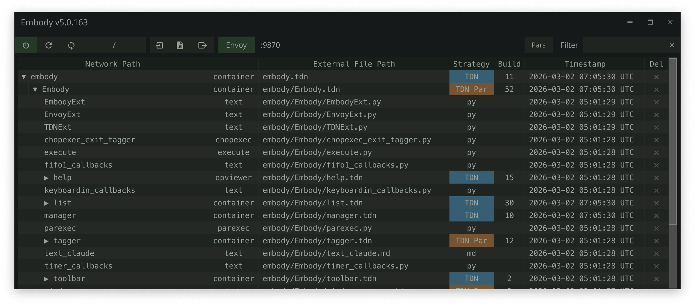

<div align="center">


# Embody

**create at the speed of thought.**

[](https://github.com/dylanroscover/Embody/releases/latest)
[](https://derivative.ca/)
[](https://modelcontextprotocol.io/)
[](LICENSE)
[](https://github.com/dylanroscover/Embody/stargazers)
[](https://github.com/dylanroscover/Embody/releases)

[**embody.tools**](https://embody.tools) &nbsp;&middot;&nbsp; [Documentation](https://dylanroscover.github.io/Embody/) &nbsp;&middot;&nbsp; [Manifesto](https://dylanroscover.github.io/Embody/manifesto/) &nbsp;&middot;&nbsp; [Changelog](https://dylanroscover.github.io/Embody/changelog/)

</div>

---

Embody puts your ideas on screen as fast as you can describe them. Operators, connections, parameters, the works. Want to try a different direction? Spin up a new approach in seconds. Compare attempts side by side. Branch off the one that works. **The tool keeps up with you, instead of the other way around.**

## Four Tools, One Idea

**[Envoy](https://dylanroscover.github.io/Embody/envoy/)** — *forward velocity.* An embedded [MCP](https://modelcontextprotocol.io/) server lets [Claude Code](https://docs.anthropic.com/en/docs/claude-code), [Codex](https://github.com/openai/codex), [OpenCode](https://opencode.ai/), [Gemini](https://github.com/google-gemini/gemini-cli), [Cursor](https://www.cursor.com/), [Windsurf](https://windsurf.com/), and [GitHub Copilot](https://github.com/features/copilot) (via VS Code) talk directly to your live TouchDesigner session. Create operators, wire them up, set parameters, write extensions, debug errors — by saying what you want. No copy-pasting code. No describing your network in chat. Idea → operators in seconds.

**Embody** — *lateral velocity.* Tag any operator and Embody [externalizes it](https://dylanroscover.github.io/Embody/embody/getting-started/) to files on disk that mirror your network hierarchy. Try a new direction, branch off a good one, restore the state from yesterday — all in seconds. Your externalized files are the source of truth, so every project opens already in flow.

**Convoy** — *outward velocity.* Convoy-enabled Embody nodes on a trusted LAN discover, inspect, and control each other — one AI session relaying builds, test runs, saves, screenshots, and restarts to every machine in the room. A small per-user background app keeps each node reachable even while TouchDesigner is closed. [Convoy guide](https://dylanroscover.github.io/Embody/convoy/)

**[TDXN](https://dylanroscover.github.io/Embody/tdn/)** — *the substrate that makes it all possible.* TouchDesigner networks exported as human-readable YAML. The format is what lets your AI agent understand what's on the screen, what lets you diff one attempt against another, and what lets a network reconstruct itself from text on the next project open. TDXN is what makes the rest of this possible.



| | What | Why it matters |
|---|---|---|
| 🤖 | **Envoy MCP Server** | 65 tools let your AI assistant build, wire, parameterize, and debug live networks. The first time you watch it happen, you stop typing operator names by hand for good. |
| 📄 | **TDXN Network Format** | Networks become text. Diff two versions, revisit any version, hand an LLM a complete picture of what's on screen — all from a single `.tdxn` file. |
| 📦 | **Automatic Restoration** | Externalized files are written on save, so any COMP can be recovered from disk. By default (Export-on-Save) the `.toe` stays authoritative on open; switch to Roundtrip mode to rebuild TDXN-strategy COMPs from `.tdxn` on every open. |
| 📤 | **Portable Tox Export** | Pull any COMP out as a self-contained `.tox` with external references stripped. Ship a piece of your project anywhere. |
| 🐍 | **Project Python Environment** | One `.venv` per project, built against TouchDesigner's own interpreter — Envoy runs from it, your packages import inside TD from it, and AI agents manage it hands-free. [Python Environment](https://dylanroscover.github.io/Embody/embody/python-environment/) |
| 🛰️ | **Convoy LAN Relay** | Convoy-enabled Embody nodes on a trusted LAN discover, inspect, and control each other through Envoy — relay test runs, saves, screenshots, and restarts to other machines from one AI session. [Convoy guide](https://dylanroscover.github.io/Embody/convoy/) |

---

## Quick Start

**Requirements:** TouchDesigner **2025.33070 or later** (Windows / macOS). No Python setup needed — Embody builds a per-project Python environment (`.venv`) matched to TouchDesigner's own interpreter, and [your own packages can live in it too](https://dylanroscover.github.io/Embody/embody/python-environment/). No special folder structure either: Embody works in any project folder, and if you happen to use git, every change is also a clean diff for free.

### 1. Install

**Download** the Embody `.tox` from [`/release`](release/) and drag it into your TouchDesigner project. The **[Setup Wizard](https://dylanroscover.github.io/Embody/embody/setup-wizard/)** opens and walks you through the choices that matter — how much autonomy Embody gets, what to externalize, whether to enable the AI assistant (Envoy) and for which tool, permissions, whether to join a trusted-LAN Convoy, and where config files live. Nothing changes until the final click, and you can re-run it anytime via the **Setup Wizard** pulse on the Embody COMP.

> **Updating Embody:** Embody updates itself — pulse **Check for Update** on the About page (or set **Auto-Update** to check at startup), and a verified release is downloaded, backed up against, and swapped in place. Your settings and tracked externalizations live on disk and survive the update untouched. See the [auto-update guide](https://dylanroscover.github.io/Embody/embody/auto-update/). Manual alternative: delete the old Embody COMP and drag the new `.tox` in its place — the new version picks up your on-disk state automatically, no re-scan, no files rewritten.

### 2. Tag and Work

1. **Tag operators** — hover any COMP or DAT and press `lctrl` twice to open the tagger (pick a strategy for a COMP, a file format for a DAT)
2. **Work normally** — press `ctrl + shift + u` to update all externalizations, or `ctrl + alt + u` to update only the current COMP. Externalized files are written on save; on open, the `.toe` stays authoritative by default (Export-on-Save), while Roundtrip mode also reconstructs TDXN-strategy COMPs from disk

> **Tip:** Externalization is opt-in — nothing is written to disk until you tag it. To capture your AI assistant's work automatically, set **Auto-Externalize New Ops** (Envoy parameter page) and everything it creates through Envoy is tagged and externalized as it's built.

For supported formats, folder configuration, duplicate handling, Manager UI, and more — see the [Embody docs](https://dylanroscover.github.io/Embody/embody/).

---

## Envoy MCP Server

Embody includes **Envoy**, an embedded [MCP](https://modelcontextprotocol.io/) server that gives AI coding assistants direct access to your live TouchDesigner session.

### Setup

1. **Pick an AI assistant in the [Setup Wizard](https://dylanroscover.github.io/Embody/embody/setup-wizard/)** — it opens on first install, or re-run it anytime (the **Setup Wizard** pulse on the Embody COMP). Prefer parameters? Toggling **Envoy Enable** (`Envoyenable`) does the same thing with your current settings
2. **Server starts** on `127.0.0.1:9870` (configurable via `Envoyport`; if the port is taken by another instance, Envoy scans forward automatically)
3. **Auto-configuration** — Envoy writes a `.mcp.json` (STDIO bridge, so tools are available even before TD is running) at your AI project root. By default that's the git repo root; the wizard's config-location step — or the `Aiprojectroot` parameter — can point it at the `.toe` folder or a custom path instead. Projects without a git repo still get config generated in the `.toe` folder
4. **Connect** — open a Claude Code session (or restart your IDE) at that root — it picks up `.mcp.json` automatically

The generated config runs Envoy's bridged STDIO transport (recommended — it can launch and restart TD for you). If you'd rather wire a client by hand, the direct HTTP transport works whenever TD is running:

```json
{
  "mcpServers": {
    "envoy": {
      "type": "http",
      "url": "http://127.0.0.1:9870/mcp"
    }
  }
}
```

### Tools at a Glance

| Tool | What It Does |
|------|-------------|
| `create_op` | Create any operator type in any network |
| `set_parameter` | Set values, expressions, or bind modes on any parameter |
| `connect_ops` | Wire operators together |
| `execute_python` | Run arbitrary Python in TD's main thread |
| `export_network` | Export networks to diffable `.tdxn` YAML |
| `create_extension` | Scaffold a full extension (COMP + DAT + wiring) |
| `get_op_errors` | Inspect errors on any operator and its children |

...and 56 more. See the [full tools reference](https://dylanroscover.github.io/Embody/envoy/tools-reference/).

When Envoy starts, it always generates an `AGENTS.md` file in your project root with TD development patterns and project-specific guidance. It also writes a client-specific config for whichever assistant you select in the `Aiclient` parameter (`CLAUDE.md` + `.claude/` for Claude Code, `opencode.json` + `.claude/` for OpenCode, Cursor/Windsurf rules, Copilot instructions, `GEMINI.md` for Gemini; Codex and OpenCode read `AGENTS.md` directly). For OpenCode and local-model setups, see the [Local Models & Open Clients](https://dylanroscover.github.io/Embody/envoy/local-models/) guide.

---

## TDXN Network Format

TDXN (TouchDesigner eXternal Network) is the file format that makes the rest of Embody possible. It exports an entire operator network — operators, connections, parameters, layout, annotations, DAT content — as a single human-readable YAML file. Your AI agent can read it. You can read it. Any text tool can diff it. The network can rebuild itself from it.

This is the substrate. Every other capability — AI-driven building, version control, automatic restoration — builds on top of it.

- **Entire project**: `ctrl + shift + e`
- **Current COMP**: `ctrl + alt + e`
- **Via Envoy**: `export_network` / `import_network` MCP tools

See the [full TDXN specification](https://dylanroscover.github.io/Embody/tdn/specification/) for format details, import process, and round-trip guarantees.

---

## Keyboard Shortcuts

| Shortcut | Action |
|----------|--------|
| `lctrl + lctrl` | Tag or manage the operator under the cursor |
| `ctrl + shift + u` | Update all externalizations |
| `ctrl + alt + u` | Update only the current COMP |
| `ctrl + shift + r` | Refresh tracking state |
| `ctrl + shift + o` | Open the Manager UI |
| `ctrl + shift + c` | Copy the selected COMP to the clipboard as a portable TDXN envelope |
| `ctrl + shift + e` | Export entire project to `.tdxn` file |
| `ctrl + alt + e` | Export current COMP to `.tdxn` file |

These are the defaults — every shortcut is editable on the Embody COMP's **Shortcuts** parameter page (type a combo, or pulse **Record** and press the keys; empty disables it). See [Keyboard Shortcuts](https://dylanroscover.github.io/Embody/embody/keyboard-shortcuts/).

---

<details>
<summary><strong>Where externalized files go</strong></summary>

Embody writes externalized files relative to your `.toe` location, mirroring your network hierarchy — no special folder structure required:

```
my-project/              ← project folder (optionally a git repo)
├── my-project.toe       ← your TouchDesigner project
├── base1/               ← externalized operators
│   ├── base2.tox        ← COMP (TOX strategy)
│   ├── base3.tdxn        ← COMP (TDXN strategy — diffable YAML)
│   └── text1.py         ← DAT
└── ...
```

</details>

<details>
<summary><strong>Logging</strong></summary>

Embody provides a multi-destination logging system:

- **File logging** (default): `dev/logs/<project_name>_YYMMDD.log`, auto-rotates at 10 MB
- **FIFO DAT**: Recent entries visible in the TD network editor
- **Textport**: Enable the `Print` parameter to echo logs
- **Ring buffer**: Last 200 entries via the Envoy `get_logs` MCP tool

```python
op.Embody.Log('Something happened', 'INFO')
op.Embody.Warn('Check this out')
op.Embody.Error('Something broke')
```

</details>

<details>
<summary><strong>Testing</strong></summary>

Embody includes **139 test suites** (4,239 tests) covering core externalization, MCP tools, TDXN format, the Envoy server/bridge, launch/config generation, install/uninstall paths, self-update, release hooks, the status readout, and palette catalogs. Tests run inside TouchDesigner using a custom test runner with sandbox isolation. Destructive whole-project suites are segregated and run only via the save-gated `RunDestructiveTests`.

```python
op.unit_tests.RunTests()                              # All tests (non-blocking)
op.unit_tests.RunTests(suite_name='test_path_utils')   # Single suite
op.unit_tests.RunTestsSync()                           # All in one frame (blocks TD)
```

Via Envoy MCP: use the `run_tests` tool. See the [full testing docs](https://dylanroscover.github.io/Embody/testing/) for coverage details and how to write new tests.

</details>

<details>
<summary><strong>Troubleshooting</strong></summary>

- **Timeline Paused**: Embody requires the timeline to be running. An error appears if paused.
- **Clone/Replicant Operators**: Cannot be externalized. Embody warns if you try to tag them.
- **Engine COMPs**: Engine, time, and annotate COMPs are not supported for externalization.

For more, see [Troubleshooting](https://dylanroscover.github.io/Embody/embody/troubleshooting/).

</details>

---

## Version History

See the [full changelog](https://dylanroscover.github.io/Embody/changelog/) for detailed version history.

**Recent releases:**

- **6.2.1**: **The 6.2.0 review release** -- the Enable/Disable toolbar button, Ctrl+Shift+O/U and Ctrl+Alt+U, and the manager's dirty column all called a demoted member on the COMP (the demotion sweep missed aliased receivers and a string-named `hasattr`); the census now catches all three shapes. Community paste closes two bypasses: a foreign extension declared through the flat `ext0object` parameter scanned clean and imported live, and the palette carve-out trusted any `op.TD<Name>` prefix while a pasted network could register that shortcut itself -- trust is an allowlist of the six shortcuts TD registers, ported to the server scanner, and global shortcuts are stripped on every paste path. The 6.2.0 `.tox` had been exported before the scanner security fix; this one carries it. `ensureCustomPar` handles RGB/XYZ tuplets and is the real caller behind the About-page stamps; the prune floor reports its refusal in the update dialog. **4,239 tests** (139 suites).
- **6.2.0**: **Three namespace tiers, and the promoted surface drops from 214 members to 43** -- filed by Function Store as issue #94: `td-python.md` taught only `Upper` = promoted and `_lower` = private, so every callback anything outside the class had to reach got a capital letter and TouchDesigner published it, and that rule ships into every project Embody touches. Now tier 1 `UpperCamelCase` is the user-callable API, tier 2 `lowerCamelCase` is the component's own wiring reached through `.ext`, tier 3 `_lowerCamelCase` is private. **BREAKING** for code that reached past the documented `op.Embody` API: roughly 170 names now live at `op.Embody.ext.Embody.<lowerCamel>()`; no documented method moved (a census test enforces it). Also: a referencing ladder that starts at `self.ownerComp`, get-or-create parameter ownership with a refusal instead of `Par.destroy()`, a proportional floor under the parameter prune, `create_extension` gains `parent_shortcut`, and 63 untrusted-import security tests that ran on no runner now run on both CI legs. **4,227 tests** (138 suites).
- **6.1.11**: **Embody stops merging the user-project template into its own repo's `CLAUDE.md`** -- making `CLAUDE.md` mergeable is right for a project that *uses* Embody and wrong for the repo that *builds* it, where that file is the developer's own instructions; the first deploy after 6.1.10 left it carrying two contradictory rule lists. A first merge into a hand-written top-level doc is now refused when the target is the tree Embody's own source lives in, narrowly enough that ordinary projects -- and the merge suite's own temp dirs -- still merge exactly as before.
- **6.1.10**: **Your own `CLAUDE.md` is merged into now, instead of being handed a sidecar nothing reads** -- if you already had one, Embody left it alone and wrote its guidance to `ENVOY.md`, which preserved your file but delivered the instructions nowhere: nothing imports `ENVOY.md` and Claude Code does not auto-load it. `CLAUDE.md` now gets the same delimited block `AGENTS.md` has had -- your content untouched, Embody's block refreshed in place, Uninstall removing only the block -- and that block now opens with a visible heading saying which half is which and where your own edits belong.
- **6.1.9**: **An update check that finds nothing no longer opens a window to say so** -- the line directly above the dialog already wrote the same sentence to the **Update Status** parameter, so every clean check reported itself twice: once in the readout, once in a modal that interrupted to announce nothing had happened. The status par is now the single report. The confirmation after a successful *install* is untouched -- that one reports a change you cannot otherwise see.
- **6.1.8**: **The idle checkpoint sweep stalled a frame for 184ms after every agent burst** -- the dirty-detection fingerprint took its recursion boundary from a set that deliberately omits Embody and everything under it, so `/embody` re-walked the whole Embody subtree its own file merely references: 184ms in one blocked frame, plus a byte-identical re-export of `embody.tdn` every time an agent touched anything. The boundary is now the tag the exporter itself stops on (197.7ms -> 59.0ms across 65 roots), and the sweep runs in per-frame slices instead of one stall, so the worst frame per burst drops from 184-211ms to 51ms. The first sweep after upgrading checkpoints every tracked root once, on purpose -- a checkpoint writes current state, while re-baselining would silently drop real unsaved work.
- **6.1.5**: **One AI client menu became two, every client got the MCP config it actually reads, and generated files now prove they are yours to keep** -- **Configure For** decides whose files Embody writes and **Launch Client** decides what the Launch button opens; five of the eight clients on offer had never been given an Envoy connection at all, because `.mcp.json` is Claude Code's format and no one else reads it. Antigravity joins the list. A single `ai_clients` registry replaces the tables that had already drifted apart. And the edit protection on generated files now rides inside the file as a content hash in its marker line, instead of a sidecar in gitignored `.embody/` that never survived a clone -- so an edit you commit is still recognised on your teammate's machine. Four ways a file you wrote could be destroyed are closed, including a hand-written `ENVOY.md` overwritten on first contact and any file that merely *quoted* Embody's marker. A file Embody cannot decode is now skipped instead of aborting the whole deploy.
- **6.1.2**: **The network format is TDXN now, and new networks export as `.tdxn`** -- Derivative asked community tools starting with "TD" to move to "TDX", and the strongest claim Embody was making was not the three letters but the expansion: "TouchDesigner Network" describes Derivative's product, not this one. TDXN is **TouchDesigner eXternal Network**, which is literally what the file is. Every existing `.tdn` opens, exports and round-trips unchanged, and none of them move -- Embody keeps writing whichever extension a COMP already uses, so only a *new* externalization mints `.tdxn`; a rename, a project-name change and an `auto` re-export all preserve the existing suffix rather than migrating it. Convert on your own schedule with the new **Migrate .tdn to .tdxn** pulse (idempotent, re-runnable, and it repoints the `tdn_ref` pointers inside parent files). Nothing machine-facing changed: the `strategy` token is still `tdn`, so are the operator tag and all 25 `Tdn*` parameters, and `read_tdn` / `diff_tdn` / `import_network` keep their signatures. Embody also now states plainly that it is not affiliated with Derivative.
- **6.0.280**: **A stuck download owned the self-updater until you restarted TouchDesigner** -- a socket timeout bounds one read, not the transfer, so a trickling connection hung forever, and the busy latch and crash sentinel that guard an update each had exactly one thing that could ever clear them. The download owns a wall-clock budget now, a failed check or download retries itself three times before giving up loudly and cancelling, every phase carries a ceiling a later attempt uses to clear a dead latch, and a leftover sentinel is resolvable in place instead of refusing every check with advice that could not work.
- **6.0.279**: **A cloned `.toe` carried its author's `D:\` git root, and Convoy could never turn on** -- the stored `_git_root` bakes into a saved `.toe` when the pre-save scrub doesn't fire, and it was trusted without an existence check, so every `.embody` write on the receiving machine failed with `WinError 3` on a drive it didn't have. A stored root that no longer exists is now dropped and recomputed by the normal walk-up, a custom root on a missing drive heals to the project folder, and the failure warnings name the full target path instead of the bare drive letter.
- **6.0.278**: **The `.tdn` stops carrying the session inside it** -- an all-default merge input sequence imported as N declared-but-unwired inputs, latching a phantom `No input POP` error on every project open (block counts now apply after wiring, and defaults are probed, not assumed); `tdn_exclude:<parname>` keeps runtime values -- ports, session paths, live readouts -- out of committed files, managed by dragging pars or COMPs onto the tagger's new Exclude from tdn panel; and the Update pulse runs frame-chunked instead of blocking 0.5-1s (zero dropped frames, with an explicit completion line).
- **6.0.266**: **A package TouchDesigner never shipped, refused as TouchDesigner's own** -- "bundled" meant any `site-packages` on `sys.path`, so a `--user` install or a second project's venv got credited to TD and refused with a false reason. Also: `extras_applied` is now verified against the venv instead of believed, and the local pytest tier has a pinned requirements file.
- **6.0.265**: **A red operator that every error tool called clean** -- `get_op_errors` never read `OP.scriptErrors()`, so a Python traceback on a DAT was invisible to agents while the network showed it red. Script errors now count toward `errorCount` and ride the write-effect footer; the TDN rebuild report reads the same surface.
- **6.0.264**: **An agent can finally see a shader that failed to compile** -- `op.errors()` reports "(none)" for a GLSL compile failure (TouchDesigner emits only a vague warning and writes the real text to the auto-docked Info DAT), so `get_op_errors` now reads that DAT and the write-effect footer carries the compile error back on the response to the very write that caused it. New `get_chop_data` and `get_pop_data` readers reduce rather than dump -- per-channel stats with op-vs-op diffing for CHOPs, and free attribute metadata for POPs with value readback gated on point count (`POP.points()` accepts and ignores its own slicing arguments, and a 160k-point readback costs ~4 frames). `get_op` collapses parameter sequences, `get_dat_content(format='stats')` reduces a table 17x, and `get_docs` fuses the wiki page with the build-accurate creation defaults Embody already harvests. Plus a cross-build parameter repair that had never once run (`findChildren(depth=-1)` matches nothing) and 191 lines of dead code removed, including an unwired delete path whose safety docstring was false.
- **6.0.260**: **Module-level venv imports survive a cold open** -- Embody authors TouchDesigner's pre-cook venv context (`TDPyEnvManagerContext.yaml` beside the `.toe`), so `.venv` is on `sys.path` before any COMP cooks and an extension that constructs before Embody can still `import` its packages (foreign contexts are never touched, deleting the file opts out, uninstall reverses it, and the wizard's footprint step discloses it); self-update validation no longer flushes dirty toxes to disk (dirty state is runtime-only now); Convoy's "Allow TD Python" gate no longer flips off on save (deviation-based reconcile replaces the voided projection flag).
- **6.0.259**: **Fleet Convoy triage: remote launch fixed everywhere, ghost rows self-clean, names can't mask machines** -- registration claimed `sys.executable` (TouchDesigner's bundled `python.exe`), so the host app's process probe refused every launch profile `runtime_unverifiable` and no node anywhere was remotely launchable (registration now claims the probed process image, and the heartbeat audit spam that came with it -- ~5,700 lines/day/node -- logs on transitions only); short-lived ghost rows retire after an hour of silence instead of 30 days; foreign name stamps heal regardless of project name and the node list prefixes the live hostname whenever a name omits it; enabling Convoy shows `Installing...` instead of holding `Disabled`, and Last Seen reads `Never` instead of `Unavailable`.
- **6.0.257**: **Supervisor-managed fleets are first-class** -- the Convoy host app installs from supervisor-launched TouchDesigner (an inherited stdin killed every spawn with `WinError 50` before any interpreter ran; children now get an explicit NUL stdin, and a genuine OS refusal reports session/Job forensics), nodes re-register deterministically at every project open (lazy extension construction left supervisor-relaunched nodes `Disabled` until someone opened the Convoy page), a repo that deliberately ignores `.embody/project.json` keeps that choice (per `git check-ignore`, with a logged warning that the realm id is now per-machine), fleets update Embody remotely with `update_embody`/`convoy_update_embody` (sha256-pinned manifest, downgrade/build-floor refusals, no TD Python grant), and the per-project `.venv` becomes a public, documented Python environment (`embody_pyenv`, extras, in-TD `sys.path` wiring).
- **6.0.254**: **A deployed .toe showed the authoring machine's hostname as its Convoy Node Name** -- the automatic `hostname / toe-stem` fill persists as a constant inside the .toe and travels with it; a baked stamp whose host half is another machine but whose project half matches this project now heals to the local hostname on open, while deliberate names are never touched (Embody-written exports were already scrubbed -- the project file itself was the carrier).
- **6.0.253**: **A saved project could be told to "save the project first"** -- the save gate asked whether a file existed at `project.folder / project.name`, but TouchDesigner reports `project.name` as the NEXT name in an incremental series (`Control.35.toe` on disk, `project.name` `Control.36.toe`), so the lookup failed on projects that had been saved for months and Enable Convoy refused. Saved-ness now comes from the NAME -- TD's `NewProject[.N].toe` placeholder means never saved, anything else means saved -- with Convoy's gate and the wizard's save step delegating to that single authority, and the real `.toe` resolved from the increment series where a file is genuinely needed.
- **6.0.252**: **A fresh macOS install hit two invisible walls** -- the Envoy venv build died decoding pip's output (GUI-launched macOS TD defaults to US-ASCII; every TD-side subprocess read is now forced UTF-8 and the pip/uv bootstrap runs with `PYTHONPATH`-class variables scrubbed, so the "Python 64-bit Module Path" preference can't contaminate the venv), and the collection "Embody it" copy flow never prompted because v6.0.251 shipped the dev machine's `Clipboardautopaste` toggle baked Off -- it now rests at its default in every export, persists per-user via config.json, and the fresh-install smoke asserts it. The embody.tools copy buttons are also Safari-safe now (ClipboardItem created inside the click gesture).
- **6.0.251**: **Worker-side `run()` is now caught at write time** -- Derivative confirmed that calling TD's global `run()` from a worker thread silently corrupts TD state (it does not raise), so Envoy statically lints `execute_python` and DAT writes and rides a **THREADING WARNING** back on the response; the full codebase audit came back clean, Envoy's own worker threads stopped printing to the Textport, Convoy's sibling API enforces its main-thread contract, and the shipped rules teach the corrected failure model plus the masked-crash diagnosis recipe.
- **6.0.250**: **The Convoy App no longer opens an empty terminal window at every Windows logon** -- uv wrote console-subsystem `pythonw.exe` launchers into the daemon's venv (astral-sh/uv#19226, fixed upstream in uv 0.12.4); the installer now reads the PE subsystem instead of trusting the filename, repairs existing installs in place on their next update or Repair Convoy App, and gates release runtime bundles on the same check.
- **6.0.249**: **One update produced three dialogs in five seconds, and every one was wrong** -- `Convoynodes<N>*` are the parameters of a runtime sequence sized to *your* Convoy mesh, but the release manifest captured the developer's own component, so it declared *their* node count as what the build ships and the updater destroyed the surplus, calling four cells of a live status readout "settings that no longer exist". A message box is modal to its script and not to TouchDesigner, so the retired-settings dialog raised five statements before the crash sentinel cleared let the startup sweep offer to roll back an update seconds from succeeding -- and "Keep Current State" deleted the sentinel out from under the verifier, leaving the old version stamped and the component pointed into `.embody/updates`. The exporter no longer declares runtime blocks, the updater refuses to destroy a sequence block whatever a manifest claims, every mutation completes before anything can block, and the sentinel records its owning process so a reloaded component knows its own update is still finishing. The **Convoy App now repairs itself** instead of logging "the payload it runs may be stale. Pulse Repair Convoy App" to a textport nobody reads: the install waits for the daemon's version to converge, performs the restart itself if it does not, and rests a surviving mismatch on **Status** as `Needs repair ...`. Also: a developer's `Showbuiltinpars` toggle had been shipping **On** in released builds, presenting TouchDesigner's built-in parameter pages to every download. Verified by making a virgin install perform a real self-update with eight live node blocks against a manifest declaring none. Also: a Pulse parameter caught mid-fire had been serializing `value: true` into committed exports twice over, so a loaded file could re-fire it -- the exporter no longer writes a value for momentary styles.
- **6.0.246**: **v6.0.245 fixed one parameter where the whole category was broken** -- the status readout needs BOTH `nodeview` and `opviewer`, and asserting `opviewer` alone leaves it greyed out and inert, so that release still presented as a no-op. The set is no longer hand-picked: a correct install carries 25 built-in parameters set away from their TD defaults, the exporter records all of them in the release manifest, and the updater asserts whatever the build declares -- so a parameter added in a future version is carried automatically. This also closes a quieter case of the same bug: `ext*object` are built-in parameters, so a build that ADDED an extension would have installed it and never loaded it. Modes travel with values (`w`/`h` ship bound; assigning `.val` would silently flatten them to constants). The tests now assert the outcome rather than the assumption that shipped broken.
- **6.0.245**: **An update could install a new feature and never let it appear** -- the in-place reload preserves every live parameter value, which is what keeps your settings across an update, but it preserved *build-owned* parameters too. `opviewer` arrived with the status readout in v6.0.233, so every user updating from an older build got the new status viz installed and never displayed: the node kept showing the old manager panel while the About page read the new version, and the update looked like it had not run (field-reported on a v6.0.152 -> v6.0.244 update). Build-owned built-ins are now re-asserted from the new build, and only when the build actually ships what they point at. The same value-preserving reload also stranded settings that newer builds had retired, so the release manifest now declares the parameters a build ships and the updater removes anything absent from it -- telling you exactly which settings went away. A custom parameter's value is still never rewritten by an update; nine tests pin the whole contract.
- **6.0.244**: **v6.0.243's own regressions, found by putting an adversarial review panel on it** -- the chunked dirty sweep ran a full table scan *per chunk* (undoing part of its own win), died permanently and silently if any one COMP's fingerprint raised, restarted from zero on every Refresh so clicking through the manager could stop it finishing, and kept running after TDN was switched off. A save could also log SUCCESS and return true with no tracking row. Plus a latent bug that predates 243: duplicate-row cleanup grouped on `type` (the OP type, identical on both rows) instead of `strategy`, so a COMP externalized as both `.tox` and `.tdn` had one of its tracking rows silently deleted on every Refresh. Ships **smaller** than 243 -- the keep-most-recent rule is one helper instead of two, position cells merge into the save's existing row write, and a dead branch is gone -- with a new suite covering the deferred sweep, the row writer, and duplicate-row semantics.
- **6.0.243**: **The command-prompt flash is gone, and the save that caused it is ~4x faster** -- TouchDesigner is a GUI process with no console, so every `subprocess` call from inside it made Windows allocate and destroy a real console window; the manager's orange "uncommitted" badge asks `git status` on every Refresh, so every save flashed an *empty* black window (the output already went through a pipe). All nine remaining TD-side spawn sites now pass `CREATE_NO_WINDOW`, guarded by a new suite that fails on any future spawn without it. Profiling the save then found ~99% of an *empty* COMP save was bookkeeping: the stale-file scan rglob'd the whole project folder before filtering to one subtree (~150-200ms -> a few ms; whole-project exports unchanged), duplicate-row cleanup re-scanned every row once per path (504.7ms -> 6.9ms), the strategy lookup ran a full table scan per COMP (82.8ms -> 18.3ms), and the duplicate-path check probed the TD tag store once per known tag per operator where one read suffices. The whole-project TDN fingerprint sweep, 255ms in one frame, is now chunked across frames. Empty TDN save 306ms -> 95ms; Refresh 724ms -> 44.5ms.
- **6.0.241**: **Two field-reported TDN bugs, both live-reproduced before a line was written** -- an individual "Reload tdn" left nested externalized children as empty shells whose stale fingerprints let the next auto-export overwrite the child's good `.tdn` with an empty network (import now restores every nested shell from its own file in the same pass, and automatic exports refuse to overwrite a non-empty file from an empty COMP); and a wire on input 2 of a fixed-connector operator exported at position 0 and reimported onto input 0 -- the exporter now enumerates real connectors, producing the sparse null arrays the spec always documented, with the same fix applied to Envoy's `get_op`/`get_connections` so agents finally see true connector indices.
- **6.0.240**: **The realm recovery gets its missing direction** -- v239's Resolve could only KEEP this machine's realm, but the field case is a machine whose own realm is the wrong one; "Join <realm id>" adopts a live-announced realm through a sequence that never passes through an unbound instant, refuses un-evidenced ids, shows reverse-DNS hostnames for the machines asking to be joined, and rebinds the current project in the same confirmed click. Field-validated end to end on a two-machine LAN.
- **6.0.239**: **The split-realm bug, root-caused and closed** -- a single UDP broadcast from any un-admitted host on the subnet could permanently wedge a daemon into `local_realm_conflict`; committed realms now move only on an admitted peer's evidence, foreign registrations refuse without poisoning state, the genesis listen window is randomized as designed, every realm transition audits its source, and `Resolve Realm Conflict...` gives the wedge an exit it never had.
- **6.0.237**: **The first session tells the truth** -- a fresh install watched Envoy turn red in the middle of its one-time dependency install (the wedge dwell is per-operation now), "Check and Notify" never checked until the second session (the fresh-install path schedules the startup check), and a Ctrl+S left the "Saved" counter claiming hours-old work (the post-save hook stamps it).
- **6.0.235**: **One status layout, minimal by design, and nothing on it that is not true** -- three rows where the marks ARE the readout, ~65% larger text at the same panel width, a red version row only when an update is genuinely waiting or failed, and a running Convoy daemon that can no longer be reported as a failed install.
- **6.0.234**: **The status readout stops reporting work that is not happening, and the setup wizard stops eating your first click** -- three rows (the auto-save, Convoy, and the project step behind them) fell through to a RUNNING default for states that mean *finished*, *stopped* or *never started*, so a fresh install drew a permanent busy mark and a stopped Convoy left a clock climbing beside work that was not happening; the auto-save row now answers how long ago the work reached disk, seeded at startup from the newest tracked write and measured against the calendar rather than folded into a 24-hour clock. The wizard's save card opened its modal from inside the click callback, which swallows the mouse-up and made every first **Next** a no-op -- broken since v6.0.204, thirty builds; every wizard modal now waits on the real mouse-up. The startup bars view is removed in favour of one status view for the whole session (the module goes 1,691 lines -> 1,076), taking the write-only published-step record with it, and every Convoy host action now names a blocked child-process spawn instead of leaking a raw OSError.
- **6.0.233**: **The Embody node says what the project is doing, agent work is actually checkpointed, and a fresh install stops failing Convoy on its way in** -- the node's viewer carries a live status readout that never fabricates a percentage, computed once per event rather than 60 times a second (a settled panel cooks zero times; a status change costs ~0.65 ms); `execute_python` and `exec_op_method`, which previously armed no auto-save checkpoint at all, now arm a coarse one; enabling Convoy waits for the Python environment Envoy is still building instead of racing it and failing; a long-lived Convoy worker no longer dies on the module teardown a save produces; a TouchDesigner that cannot spawn child processes is reported as such instead of blaming your Python; and a live Embot could still reach a `.tdn` through the asynchronous project-wide export, now closed from both walks.
- **6.0.222**: **A review of 219/220 found a data-loss defect in the release itself** -- the reaper could delete a delivery record it had merely failed to *open* (an antivirus handle, fd exhaustion, a concurrent rename), including the unacknowledged `indeterminate` that is the sole may-have-run proof. Corruption must now be proven and a proven-corrupt record is quarantined rather than deleted. Plus: everything the Convoy App writes is flushed before the rename that publishes it; two silent ways the reconcile loop could stop until TD restarted; the button's help and log line now match the contract the code enforces; and the two paths of the 219 fix that mutation testing showed were untested.
- **6.0.220**: **Upgrading Embody can update the Convoy App without restarting TouchDesigner** -- the automatic daemon update is budgeted one attempt per TD session, and both its guards live in a session store that survives the Embody COMP being replaced. So an upgrade in a live session could never update the daemon: new Embody, old daemon, none of the fixes it was upgraded for. The budget is now keyed on the Embody version too, so an upgrade re-arms exactly one attempt without re-opening the retry loop. Live-verified: a fresh install took this machine's daemon from 6.0.212 to 6.0.220 on its own.
- **6.0.219**: **Duplicate node rows clear themselves** -- one predicate treated "a delivery that has not finished" and "a finished result nobody collected" as the same thing, and it gated all three cleanup paths, so a single uncollected result made a duplicate row permanent (a field machine had 11 rows and 123 job records, 115 of them exactly that class). A finished result no longer pins a row anywhere; a queued delivery on a superseded identity is durably refused rather than left to haunt it; work past the dispatch boundary is never touched. Forget Offline Nodes stops logging a refusal as a success, names the nodes it kept and the deliveries pinning them, and restores a declined row in the same frame. Two latent ghost-resurrection paths (commit-before-write on both delete paths) closed, and an unreadable job record no longer freezes cleanup forever.
- **6.0.217**: **Forget Offline Nodes clears the blocks in the same frame** -- the confirmed rows leave the sequence synchronously with the click, with no daemon round trip in the visual path; the daemon apply runs behind it purely as reconciliation.
- **6.0.216**: **The forget redraw is real** -- a confirmed forget supersedes the already-armed reconcile tick (which captures its delay when it schedules) and arms a fresh one two frames out.
- **6.0.215**: **Forget Offline Nodes pulls its redraw forward** -- a confirmed forget marks the register due and drops the tick to its minimum instead of waiting out the 30-60 s heartbeat.
- **6.0.214**: **Manager container alignment fix** -- the manager UI's container justifies its children to the top.
- **6.0.213**: **The Convoy App updates itself** -- the daemon reports the version of the code it actually runs, an older one is updated in place the moment a newer Embody registers with it (installs verify the daemon they restarted), and the last two duplicate-row ghost classes are gone: a Save-As into a new folder retires the old row, and a reclaimed port's stale claim is cleared.
- **6.0.212**: **Readable dialogs** -- every message box wraps its prose to ~70 characters per line through one central choke point (structure and file paths preserved), and Forget Offline Nodes shows a visible all-clear instead of a silent log line when there is nothing to forget.
- **6.0.211**: **One project, one row** -- a live session's versioned save no longer leaves a ghost duplicate in the Convoy node list (the old row held a port that belonged to its own successor and read as "live" forever); plus the new **Forget Offline Nodes...** button, which names every row in a confirmation before removing this machine's offline entries.
- **6.0.210**: **`op.Convoy`** -- the convoy COMP carries a global OP shortcut, so scripts and docs address it as `op.Convoy.ext.ConvoyExt...` instead of a path chain; contract-test pinned.
- **6.0.209**: **Repair Convoy App works over a running daemon** (and the Host App buttons are renamed Convoy App) -- macOS bootstrapped onto the still-loaded LaunchAgent label (launchctl EIO 5), so repairing a healthy host app always failed; the installer now gracefully stops the old daemon, boots the label out, waits for launchd to drop it, then bootstraps. Windows gets the same graceful stop (the old process silently kept running old code). Also: the "no usable interpreter" warning fires once instead of three times, and never on an unsaved project.
- **6.0.208**: **Convoy stale nodes clear themselves** -- the host app's retention sweep forgets nodes whose `.toe` was deleted (after ~30 min of silence) and nodes unseen for 30 days, never touching merely-offline or busy nodes (an unplugged drive is never read as a deletion); the new `convoy_forget_node` tool wires the daemon's existing recovery route for immediate manual cleanup.
- **6.0.207**: **A fresh install writes nothing to disk before the project is saved** -- the `logs/` folder, `.embody/` catalog, externalizations table, and project state files all deferred behind the wizard's save gate instead of landing orphaned in TouchDesigner's default folder (file logging resumes on the first post-save line; the catalog flushes post-save; additions self-heal on the first sweep). Also: Convoy node names stop baking the unsaved `NewProject.1` placeholder -- the Node Name fill waits for a saved project and heals already-baked placeholders in place.
- **6.0.206**: **Wizard save button un-wedged** -- the save step's option group was never registered with the wizard's central click router, so on a fresh project the "Save the project now" card ignored every click and the wizard was stuck; the group is wired, the action card fires once per click (a canceled dialog no longer reopens), and a routing contract test pins every group to the router pattern.
- **6.0.205**: **Wizard footer pinned** -- 6.0.204's self-sizing descriptions outgrew the fixed panel on the three tallest steps, clipping Back/Next off the bottom; the panel is now sized to the tallest step and a fill spacer pins the footer to the same bottom position on every page, with a new contract test that recomputes every step's stack from `wizard.tdn` geometry so an outgrown panel fails in CI instead of in the field.
- **6.0.204**: **The Setup Wizard gains a save gate** -- a never-saved project now gets a "Save your project first" step before all others (everything the wizard creates -- .venv, AI config, .embody state, the git repo -- lands relative to the project folder), with Next locked until the project is on disk. Wizard descriptions now size themselves, so every page's options start the same gap below the text (fixes the Convoy description cutoff and the permissions page's offset). Every screen capture-verified.
- **6.0.203**: **Self-update works on macOS** -- every HTTPS call from TD's bundled Python (update check, update download, `get_docs` web fallback, PyPI version check) failed `CERTIFICATE_VERIFY_FAILED` on Macs because that Python has no default CA path; Windows only worked via the OS cert store. All four sites now verify through certifi's bundle (shipped inside TD) loaded beside the system defaults -- verification never disabled.
- **6.0.202**: **A dead drain chain can no longer wedge Convoy** -- the macOS field test's second find: the frame-side poll chains delivering worker results could die silently (exception, or a stale-instance misfire) with their busy flag orphaned, freezing host status and refusing every safety-policy toggle until a TD restart. All three worker slots now recover instead of refusing -- crashing drains log their traceback and clear the slot, guards deliver parked results on the spot, and a 15-minute wall-clock bound backstops a vanished worker. Nine new contract tests.
- **6.0.201**: **Convoy enables on macOS** -- the real blocker was macOS **library validation** (TouchDesigner's signed Python refuses every PyPI native module when launched standalone; the truncated log had been misread as an architecture mismatch). Convoy now classifies the three interpreter failure modes distinctly, repairs only what a reinstall can fix, and **builds a dedicated daemon venv** from a Python outside TouchDesigner's signature domain (Homebrew, by absolute path), reusing it across installs and naming it in the uninstall preview. Venvs also stamp their CPU architecture, so a TouchDesigner Intel<->Apple-Silicon swap rebuilds the environment instead of rotting it silently. Both CI legs green again: a macOS socketpair deadlock, the git-LFS same-directory refusal, a machine-dependent float sliver in the bridge's read budget, and three 100 ms lifecycle races -- each root-caused, none papered over. **3,329 tests** (118 suites).
- **6.0.171**: **Convoy relays work into TouchDesigner** -- the host app's dispatcher now drains its own queue (a `dispatching` claim state, a compare-and-set so two dispatchers can never double-run a job, and the forward moved OUT of the global lock so a 30 s relay cannot freeze every route), long operations (`run_tests`, `save_project`) relay end to end through node-job polling with the node's own verdict mirrored back, and **TouchDesigner registers itself**: a new Convoy parameter page plus a `ConvoyExt` child COMP that finds the local host app, registers its live Envoy port, heartbeats, and asks once -- naming the convoy id it will mint and the scope it grants -- before writing anything. The **bridge streams**: server-pushed frames and `tools/list_changed` reach the client as they arrive instead of dying in a buffer, and every severed response now answers the client (two shapes were silent hangs in every shipped version). Ten adversarial review rounds across four slices found 40+ probe-reproduced defects. Also fixed: `raise SkipTest` in `setUp` had always been miscounted as an ERROR by the test runner. **2,895 tests** (114 suites).
- **6.0.169**: **Perform Mode no longer fights the Envoy liveness watchdog** — entering Perform Mode stops Envoy but deliberately leaves `Envoyenable` on, and the watchdog read that enabled-but-down state as an outage: it revived the server ~4-12 s into every performance and overwrote the `Perform Mode` status readout with `Reviving (watchdog)...`. Perform Mode is now a first-class watchdog idle condition gated on the live par authority (never the status string), `Start()` refuses mid-Perform, and — from the adversarial review of the fix itself — an in-flight start can no longer cross a Perform entry: all three startup polls honor Perform, tearing down a worker that bound mid-entry instead of declaring `Running` over the show. The thread-exit hooks were unified onto the same authority helper, whose failure mode (errors read False) can never disable self-healing. Also: **TDN files export with LF line endings** (the writer pinned `newline='\n'`, closing the same churn class v6.0.168 fixed for generated rules). Twelve new watchdog tests, including the poll gates and the unstubbed authority wire. **2,516 tests** (112 suites).
- **6.0.168**: **No more phantom git changes from Embody's own generated files** — `Path.write_text()` defaults to `newline=None`, translating line feeds to CRLF on Windows, so `write_template` rewrote every generated rule and skill with CRLF on each deploy while `.gitattributes` declares `*.md eol=lf`. That produced a permanent row of `M` badges with an EMPTY `git diff` (the eol attribute normalizes on compare, so `git status` and `git diff` disagree) — and in a user project lacking `.gitattributes`, CRLF got committed and churned against macOS/Linux collaborators. Ten write sites now pin `newline='\n'` (`write_template`, the CLAUDE.md/ENVOY.md writers, both JSON manifests, the `.gitignore`/`.gitattributes` editors), and the nine already-CRLF files were normalized once. Scoped deliberately to Embody's own writers: 103 tracked files carry CRLF from ordinary Windows editing, but those are inert because nothing regenerates them. **2,504 tests** (112 suites).
- **6.0.166**: **Multi-agent flow** — a **shared task ledger** (`announce_task`/`update_task`, `.embody/tasks.json`) gives parallel AI sessions work-STATE, not just presence: `done_uncommitted` marks finished work sitting uncommitted in the tree (born from a real misread the same morning — a finished feature held another session's batch because nothing shared records completion), active entries ride on `get_sessions`, and `preflight_landing` warns before anyone lands over uncommitted finished work. **Long operations become restart-proof background jobs** (`run_tests background=True`, new `save_project`, `get_job_status`): handles return immediately and results park in `.embody/jobs/`, surviving the server restarts that severed synchronous calls twice in one day. Plus: the write-effect footer stops counting TD's own `/ui` warnings as your damage, and the **fresh-install smoke runs fully headless** (the harness drives the Setup Wizard's backend instead of stalling on its panel). Tools 56 → 60. **2,542 tests** (112 suites).
- **6.0.165**: **Five agent-experience features from a competitor teardown** — a full code-level audit of a rival TD AI plugin exposed five real gaps, closed here without adopting its telemetry, system-file patching, or runtime prompt manipulation. **`get_guidance`** finally serves this project's rules and skills (36 documents) over MCP, so Codex/Cursor/opencode agents get the same TouchDesigner doctrine Claude Code loads instead of only tool schemas. **`get_focus`** reports the pane's network, selection, current op and rollover with an explicit disambiguation rule ("this operator" is the SELECTED op, never the incidental rollover). Mutating tool calls now ride back an **`_effects`** block naming errors and warnings that did NOT exist before the call plus a meaningful fps drop — diffed against a per-session baseline, self-disabling if the scan exceeds its time budget, and reading the Perform CHOP only when it already exists so a write never creates a monitor as a side effect. The **setup wizard now offers externalization** (whole project / new work only / not now), gated to refuse without a saved `.toe` recovery point and routed through the existing `ExternalizeProject()` so its confirmation dialog still applies. And **launching a CLI agent seeds its opening prompt** once per project, positionally (never `-p`, which would answer once and exit), with GUI editors untouched. Adding two tools tripped `test_version_sync`, which caught a README badge a feature-table grep missed. **2,516 tests** (110 suites).
- **6.0.162**: **MCP SDK 2.0** — the SDK's overnight 2.0.0 release removed `mcp.server.fastmcp` and **broke every fresh install** (issue #81: Embody's dep spec had no ceiling, so new venvs resolved 2.0.0 under 1.x code; the import gate checked only `mcp.server`, which 2.0 still provides, so the failure surfaced as a 30-minute restart storm). Envoy now runs on `MCPServer` natively — verified against the real wheel on TD's exact Python: tools, prompts, `Image` captures, `Optional[Literal]` schemas, DNS-rebinding rejection, and old-revision client handshakes all pass, so existing Claude Code sessions keep working. The pin is a range (`mcp>=2.0.0,<3`), and **venvs now self-upgrade**: each install stamps the venv with its dep spec + Python; any release that changes a pin auto-upgrades every existing venv on next start (a TD Python bump rebuilds via `uv venv --clear`), and upgrading a live session refuses with an honest "restart TouchDesigner to finish the upgrade" instead of importing a mixed stack that can abort() TD. Also: 2.0's silent 4 MiB request-body cap raised to 64 MiB (big `import_network` payloads no longer masquerade as lost connections), and its `logging.basicConfig` side effect (root stderr handler at INFO, process-wide) is undone so the textport stays clean. **2,424 tests** (108 suites).
- **6.0.160**: **Two guards that were silently off** — `is_pid_alive` used `OpenProcess` alone, but a Windows process object (and its PID) stays allocated while any handle to it is open, so **exited processes read as alive forever**: dead registry rows were never pruned, the basename was never reclaimed, and every relaunch minted another `-2`/`-3` instance while bridges chased a corpse (stranded heartbeats also lingered as phantom peers). A zero-timeout `WaitForSingleObject` distinguishes signaled-on-exit from running. Separately, the test runner's `_running` was instance state, so editing any `syncfile`'d source mid-run rebuilt the extension and **disarmed dialog suppression** — a real "Embody — Uninstall" modal escaped to the user, and once clicked it stopped the live Envoy server; it is now storage-backed with a refreshed TTL. Six more runtime keys (including `_smoke_test_responses`, which would have auto-answered real modals) stopped leaking into committed `.tdn`, now enforced by an **invariant** test rather than a hand-maintained list. Clipboard suites SKIP loudly on OS clipboard contention instead of blaming the watcher, and the fresh-install smoke waits for a terminal Envoy state and writes an explicit verdict. **2,407 tests** (108 suites).
- **6.0.159**: **Field-report triage** — `remove_externalization_tag` had been a DEAD MCP tool since v6.0.154 (its wrapper always forwarded `delete_file`; the handler took only `op_path`, so every call returned a TypeError) and shipped through two releases green, because no test had ever invoked a registered tool wrapper — now fixed and permanently guarded by a **tool-schema conformance** suite that checks all 54 tools for three directions of wrapper/handler drift. Closed a **silent `.tdn` deletion on every save**: `checkOpsForContinuity` used a bare `op()`, which cannot resolve a utility `annotateCOMP`, so a legacy row at an annotation read as a vanished operator. **TDN sequence export** now discovers via `target.seq` (pars-based discovery misses sequences on an uncooked POP) and can no longer emit an unimportable `name: []`. Plus `.gitignore` duplicate-header consolidation, two silent config migrations that had never run, and a `crash_detected` flag that stuck forever after an external TD relaunch. **2,400 tests** (108 suites).
- **6.0.157**: **Per-session bridge routing** — each session's bridge pins to a TD instance by name (registry churn can't re-target it; a pinned instance's port change still self-heals), `switch_instance` moves only the calling session (`all_sessions=true` + `active_epoch` for the explicit whole-user move), and registration is adopt-if-vacant — a fresh instance can no longer yank every live session's bridge (verified live: second instance registered, five sessions, zero bridges moved). Worktree tasks get **durable claims** (survive session death + Envoy restarts, visible via `get_sessions.worktrees`) and the new **`preflight_landing`** tool checks a worktree diff against main-tree dirt, peer territory, and unsaved TDN state before landing. Undo-block guard self-heals a severed begin/end pair. **2,357 tests** (104 suites).
- **6.0.156**: **AI-guidance context overhaul** — the heaviest always-loaded rules become slim invariants with full recipes relocated into the on-demand skills that load at point of use (`/create-operator` gains the canonical positioning recipe and covers all creation/movement; `/td-api-reference` gains referencing patterns, cook-model gotchas, and a Heavy-Build Safety section), cutting resident context ~50%. Envoy tool docstrings now state their skill prerequisites and 7 parameters became schema-enforced `Literal` enums (documented values unchanged). A 5-reviewer line-level conflict audit fixed 11 drifts across rules/skills (glslMAT docks vertex/pixel/info, time-dependent cook-model, absolute-path examples, TDN YAML wording, `project.dirty` -> `project.modified`, ...). Smoke harness fails loud on locked cleanup. **2,337 tests** (104 suites).
- **6.0.154**: **Large TDN exports get a progress dialog** — `ExportNetworkAsync` (behind the toolbar export button, the export shortcut, and whole-project TDN export) now opens a small centered window for exports of >= 500 operators: title, a live `N / total operators (pct)` status line, a progress bar, and a **Cancel** button (consumed on the next batch boundary — no file written, worker unwinds clean). The work was already batched across frames (now tunable via `batch_size`), so TD stays responsive — verified live at **10,260 operators** (held 60fps) and a 3,060-op content-heavy network that serialized to a 3 MB `.tdn`, where a synchronous export blocks ~1.5s. The completion frame no longer stacks window-teardown + tracking + list-rebuild (post-export drop burst gone). Plus two untag fixes: **TDN untag no longer leaves a ghost row** (`remove_externalization_tag` routes through `RemoveTDNEntry`, clearing the table row + `_tdn_rel_path` breadcrumb the refresh sweep kept resurrecting; new `delete_file` flag, default off), and **`externalize_op` reports the real `.tdn` filename** for `tag_type='tdn'`. **2,337 tests** (104 suites).
- **6.0.153**: **Envoy port scanner survives a zombie TD holding a port** — `_findAvailablePort` now probes candidates with a real `bind()` instead of a TCP `connect()`. A windowless leftover TouchDesigner can hold a port bound + LISTENING with a dead accept loop, so connects are refused (old probe read it "free") while uvicorn's `bind()` still fails with `WinError 10048` — and the retry loop re-elected the same poisoned port for the full 30-min window (observed: a second `.toe` in one repo crash-looped on a port an hours-old dev instance still camped). The bind probe does exactly what uvicorn does, so a dead listener can't fool it (and it drops the 1s connect-timeout per busy port). Plus a 10-minute **bind-failure blacklist** so a probe/bind race advances to the next port instead of looping; a confirmed bind clears it. **2,327 tests** (103 suites).
- **6.0.152**: **Release hooks for Export Portable Tox** (issue #74) — `pre_release` runs on a throwaway staged copy ([Private Investigator](https://github.com/AlphaMoonbaseBerlin/TD_Private_Investigator)'s model: shape the artifact, live comp untouched, hook code never ships), `post_release` runs on the original after the save with the path + success flag; failed pre-hooks keep the staged copy for inspection. **OpenCode is a first-class AI client** — generated `opencode.json` spawns the same STDIO bridge, loads the generated rules, and uninstalls cleanly; new **Local Models & Open Clients** docs page. **Setup wizard asks about git** (initialize or skip — no more silent handling) and lists OpenCode. **`ReleaseAll()`** batch-exports every tracked, hook-bearing component; **Show Built-in Pars** toggle (Advanced) unhides TD's parameter pages. `localhost` → `127.0.0.1` across all shipped/machine surfaces. **2,321 tests** (103 suites).
- **6.0.149**: **Auto-Update controls moved to the About page** — `Autoupdate`/`Checkforupdate`/`Updatestatus` now sit with the version info (section break below Date), returning Advanced to its focused shape. Behavior unchanged. **2,225 tests** (101 suites).
- **6.0.148**: **Custom-pages-only parameter dialog** (the POPX pattern) — `showCustomOnly` on the Embody COMP shows the 9 Embody pages instead of those plus TD's built-in Layout/Panel/Look/... pages (still functional, just filtered); applied in `EmbodyExt.__init__` so existing installs converge after updating. Parameter Reference truth-synced to the component's par help (`Update Status` default is `Disabled`). **2,225 tests** (101 suites).
- **6.0.147**: **Update-available dialog trimmed** — version pair, a release-notes link, Install / Not Now; the embedded 600-char notes body is gone (a yes/no prompt is a decision, not a reading assignment). Renders from the installed updater, so it applies to checks made on v6.0.147+. **2,223 tests** (100 suites).
- **6.0.146**: **`Update Status` is never blank** — it rests at `Disabled` whenever Auto-Update is Off: on a fresh install (v6.0.145 shipped an empty field, which read as broken), on every project open (replacing stale results from sessions that had checks on), and the moment the preference is flipped. Fresh-install `.tox` smoke is now a mandatory release step — the miss that shipped the empty field. **2,223 tests** (100 suites).
- **6.0.145**: **Annotations are never externalized per-op** (external report: all four issues verified, then fixed) — code-created annotations could be swept into bogus per-op TDN/source boundaries whose reconstruction gutted the widget's TD-managed internals (`float(None)` cook errors) and stranded orphan files; tagging now refuses annotates and their interiors at every layer, legacy rows are inert with cold-open re-checks, and `create_annotation` creates **`utility=True`** (TD-UI parity — live-verified that sweeps cannot see utility subtrees). **Every op-path Envoy tool resolves utility annotations** via a shared resolver (~34 tools; `delete_op` no longer says "Operator not found" on a path `get_annotations` just listed), and **annotation deletion is durable** (purge + checkpoint drop the semantic entry; no more resurrection — delete via `delete_op`, never raw `.destroy()`). **Self-update ships**: manifest-gated (`embody-release.json`: sha256/size/`min_td_build`), background download + verify, backup + rollback, settings preserved — `Autoupdate` defaults to Off. Destructive-test save-gate fixed (`project.modified`; `project.dirty` doesn't exist on TD 2025). Adversarial 5-lens review + cold-open restart smoke. **2,220 tests** (100 suites).
- **6.0.141**: **Issue #57's MCP `create_op` freeze fixed at its trigger** — on one reporter's TD 2025.32460 the first mutating call of a session wedged TD's main thread permanently (dump-verified: viz editor work in the same frame as the network mutation); two activation gates now guarantee the MCP response is delivered before any Embot/camera editor work runs, and the first activation after dormancy pings the node colour only (new `test_envoy_viz_gates` suite; adversarial panel: no defects). **TDN locked-content warnings** collapse to one combined dialog with a Don't-show-again preference (`Tdnlockedwarn`). **Dirty badges no longer vanish** after extension source edits (fingerprint cache survives reinit). Manager filter gains a **`dirty` keyword** + force-expand. `.tdn` git diffs are **UTF-8-safe**, and runtime storage (`git_status`, `expand_order`, `_tdn_fingerprints`, `_suppress_dialogs`) stays out of `.tdn` exports. **2,171 tests passing** (98 suites).
- **6.0.138**: New shipped skill **`/brief`** — a task-brief compiler: `/brief <conversational request>` turns plain English into a reviewable contract in `briefs/` (the skills to load, live-discovered anchors, verifiable success criteria, performance/multi-session/worktree gates) that the work then executes from — portable to sub-agents and fresh sessions; ships to user projects as the 14th skill, with a Task Briefs section in the generated `CLAUDE.md`. **Launch AI Client** now walks through a missing CLI's install in the opened terminal — the official per-OS command on its own copy/paste line, shell-correct for zsh and cmd.exe (`test_launch_aiclient` 29 → 42). New sync guard: every template-map entry must resolve to a live, non-empty template DAT (a silent-shipping gap caught in review). **2,142 tests passing** (93 suites).
- **6.0.136**: TD 2025 **external-tox reload triggers fixed** — `reloadtoxpulse` does not exist on TD 2025 (the reconcile pass aborted on `tdAttributeError`), toggling `enableexternaltox` off→on does not re-read the `.tox` (manager "Reload from disk" was a silent no-op), and setting `externaltox` mid-session does not auto-load (`RestoreTOXComps` restored **empty shells**). All three paths now pulse `enableexternaltoxpulse` (verified empirically on 2025.32820 + 2025.33070), restores **fail loud** via `externalTimeStamp` (a dead shell is destroyed, never silently kept where a later save could export it empty), and `ReconcileMetadata` guards each row. Root-caused during the stale-tox-restore investigation, which established that on TD 2025 the externalized **file wins** over tox-embedded DAT snapshots in every load path. New `TestTOXRestoration` suite (6 tests); fresh-install smoke-tested from the shipped `.tox`. **2,123 tests passing** (97 suites).
- **6.0.135**: The upgrade **Skip/Re-scan dialog is gone** — dropping a new `.tox` into an existing project now **validates tracked operators quietly** (schema migration, path normalization, per-row continuity, dirty-only re-export) instead of the old "Re-scan", which deleted every tracked file and re-exported the whole project in one synchronous frame — a minutes-long freeze on large projects with a crash window of zero files on disk. A full rebuild stays available via Disable → Enable, which discloses the deletion. Minimum TD build is now **2025.33070**. New `test_verify_upgrade` regression suite; **2,122 tests passing** (97 suites).
- **6.0.134**: TD 2025.33070 first-launch **palette-scan freeze** (loading `geoPanel.tox`/`chromaKey.tox` can wedge the new build's frame loop within a frame of `loadTox` returning -- a TD-side race, reproduced with no Embody code and reported upstream) fixed **structurally**: the scan no longer loads components into TD at all -- a background worker runs TD's bundled `toeexpand` per palette `.tox` and reads type + child count from the expansion (**zero frame drops**; the old path blew the 60fps budget on 78 of its first 91 loads); **33070 bootstrap rows ship pre-baked** (267 components -- current installs never scan); a **freeze sentinel** convicts and skips any future wedge-causing component after one relaunch instead of freeze-looping; legacy loadTox scan is fallback-only, hardened with `allowCooking=False` + blocklist. A save-wedge regression in the sentinel's first iteration (teardown cross-extension call during `ExportPortableTox`'s strip-triggered reinit) was caught and fixed pre-ship. **2,117+ tests passing** (19 new).
- **6.0.131**: Issue [#57](https://github.com/dylanroscover/Embody/issues/57) (Windows MCP transport) -- the STDIO bridge and the HTTP-fallback config target **`127.0.0.1` instead of `localhost`** (Windows resolves `localhost` to `::1` first while Envoy binds IPv4-only; on firewalls that stealth-drop loopback SYNs every MCP call burned ~2s and a full drop became the reported multi-minute `create_op` hang -- measured 2.1s -> 0.07-0.27s per call after the fix); Envoy no longer **restart-storms** when its base port is held by another TD instance (observed 575-attempt loop: generation-stamped restart scheduling, in-flight-start guards, ownership-checked force-close, loud dead-on-arrival diagnostics); bridge **liveness is instance-aware** -- the active instance's image-verified registered PID or its answering port, never "any TouchDesigner process exists" -- and `restart_td` can no longer quit a *different* project's TD on multi-instance machines; `delete_op` purges tracking rows and files for **every** strategy (clone/shared-file guarded); TDN **renames no longer leak the old `.tdn` on Windows** (`Path.replace` overwrite parity); bridge `tools/list` augmentation is idempotent (template/fallback drift healed); launch scripts emit forward-slash paths on every platform. Full Windows suite green for the first time: **2,085 passed / 0 failed** (7 platform skips). Fresh-install smoke-tested from the shipped `.tox`. **92 suites / 2,092 tests**.
- **6.0.128**: Issue [#60](https://github.com/dylanroscover/Embody/issues/60) (Embody in a default startup file) -- the first-launch **palette catalog scan** no longer un-pauses a timeline the user paused mid-scan (per-chunk snapshot bracket), **checkpoints every 25 components and resumes** on the next launch instead of restarting from zero when TD is closed mid-scan (atomic writes; can't wedge, can't re-enable a Disabled Embody); the **"Dropped .tox Expression Detected"** sweep and Externalize Full Project now honor `tdn_exclude` ancestry-wide, plain Ignore holds for the session, and `Toxdropexpr` persists so "Always" answers survive new untitled projects (Envoy opt-in honors restored config the same way); the **venv probe** runs once per session per venv path and a timeout no longer deletes a healthy venv. New shipped rule: **worktree-td-safety**. **92 suites / 2,090+ tests**.
---

## Contributors

Originally derived from [External Tox Saver](https://github.com/franklin113/External-Tox-Saver) by [Tim Franklin](https://github.com/franklin113/). Refactored entirely by Dylan Roscover, with inspiration and guidance from Elburz Sorkhabi, Matthew Ragan and Wieland Hilker.

Want to help? Start with [CONTRIBUTING.md](CONTRIBUTING.md) — this repo works differently from a typical Python project (TouchDesigner writes many of the files), and that page explains what is safe to change and how to run the tests.

## Trademarks and Affiliation

Embody is an independent open-source project. It is not affiliated with, endorsed by, or sponsored by Derivative. TouchDesigner is a trademark of Derivative.

## License

[MIT License](LICENSE)
