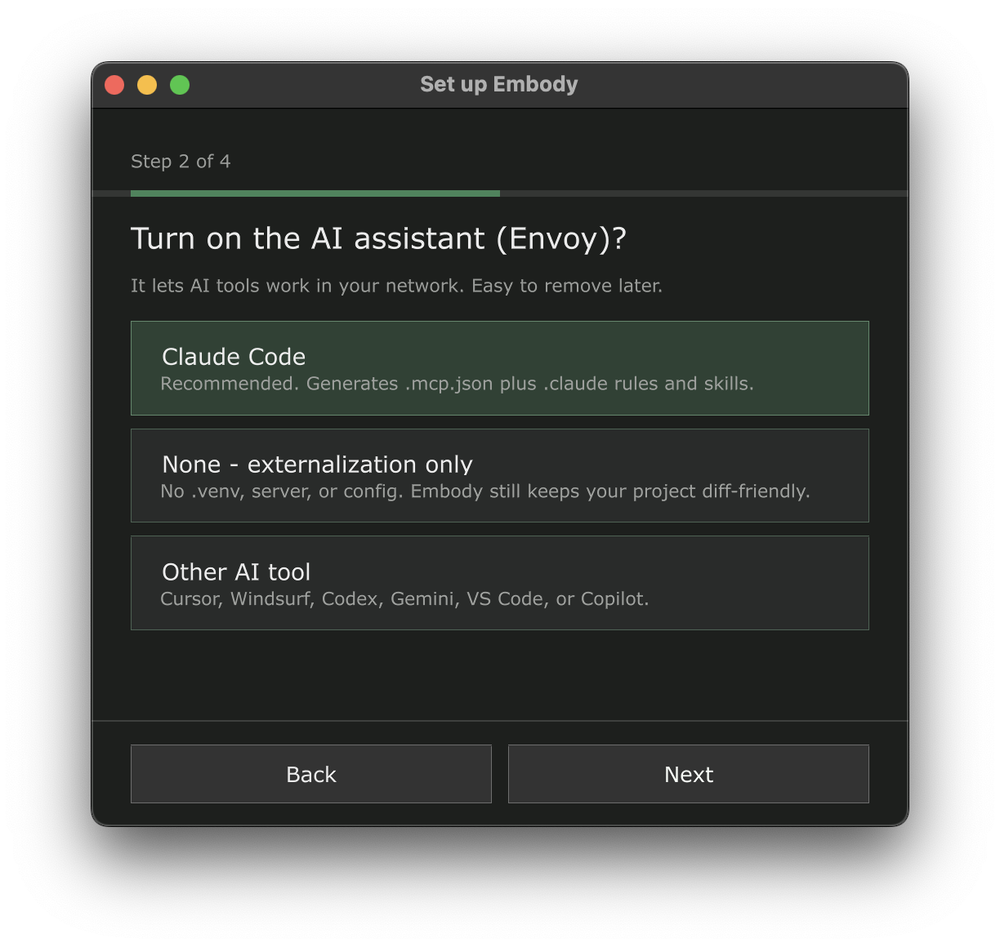
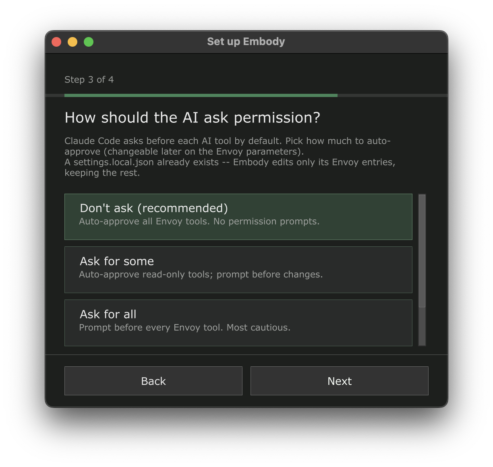

# Setup Wizard

The **setup wizard** is Embody's onboarding surface. It opens the first time you drop the Embody `.tox` into a project and walks you through the choices that matter — how much autonomy Embody gets, whether to turn on the AI assistant (Envoy), and where config files are written — one decision per screen.

**Nothing changes until the final click.** Every screen up to the summary only records a selection; the summary itself says so, and only the **Set up Embody** button applies anything. Closing the wizard early (**Not now** on the first screen, or closing the window) leaves your project completely untouched.

## When it opens

- **First run** — after you drag the Embody `.tox` into a project and initialization finishes. On an upgrade, it waits until any verification dialogs have resolved, and it only appears if Envoy isn't already enabled. It never opens during a project save or a test run.
- **Re-run anytime** — pulse **Setup Wizard** (`Setupwizard`) on the Embody parameter page. The wizard reopens preset to your current settings, so you can review or change any choice without starting over.

## The steps

The wizard adapts to your answers — three to five screens plus a summary, with a progress bar showing where you are.

### 1. Mode — how Embody manages your project

| Option | Meaning |
|---|---|
| **Auto** (recommended) | Embody manages everything on its own — git housekeeping, the Python environment, config files. |
| **Advanced** | Embody asks before touching git, your Python env, config files, or your network. Full control, minimal surprise. |

Sets the **Mode** (`Embodymode`) parameter. The choice also governs how Embody handles *later* invasive actions (a startup repair, `InitGit()` / `InitEnvoy()`), not just this setup pass.

### 2. AI assistant — turn on Envoy?

{ width="620" }

| Option | Meaning |
|---|---|
| **Claude Code** (recommended) | Generates `.mcp.json` plus `.claude/` rules, skills, and slash commands — the fully auto-configured path. |
| **Other AI tool** | Cursor, Windsurf, Codex, Gemini, VS Code, or GitHub Copilot. |
| **None — externalization only** | No `.venv`, no server, no config files. Embody still keeps your project diff-friendly. |

Envoy is easy to remove later — see [Removing Embody](getting-started.md#removing-embody).

### 3. Pick your AI tool *(only when "Other AI tool" is selected)*

Choose which client Embody generates config for: **Codex** (`AGENTS.md`), **Cursor** (`.cursor/`), **Gemini** (`GEMINI.md`), **VS Code** (MCP config), **GitHub Copilot** (`.github/`), or **Windsurf** (`.windsurf/`). Sets the **AI Client** (`Aiclient`) parameter. `AGENTS.md` is always written regardless of the client.

### 4. Permissions — how the AI asks *(Claude Code only)*

By default, Claude Code prompts before every MCP tool call. This step chooses how much Embody pre-approves in `.claude/settings.local.json`:

{ width="620" }

| Choice | Effect |
|---|---|
| **Don't ask** (recommended) | Auto-approves all Envoy tools — no permission prompts, and new tools are covered automatically. |
| **Ask for some** | Auto-approves read-only tools; anything that creates, edits, deletes, or executes still prompts. |
| **Ask for all** | Pre-approves nothing — Claude Code prompts before every Envoy tool. Most cautious. |
| **Leave settings alone** | Embody never creates or modifies `settings.local.json` — you manage permissions yourself. |

Sets the **Tool Permissions** (`Toolpermissions`) parameter, which you can change anytime without re-running the wizard. If a `settings.local.json` already exists, Embody edits only its Envoy entries and keeps everything else you've set — the wizard tells you so on this screen. See [MCP Tool Permissions](../envoy/setup.md#mcp-tool-permissions) for the full details.

### 5. Footprint review *(Advanced mode only)*

In Advanced mode (with an assistant selected), the wizard discloses everything it is about to add before you confirm:

- A Python environment (`.venv`) and the MCP server
- Config files — `.mcp.json`, the `.embody/` state folder, and AI rules for your client
- `.gitignore` / `.gitattributes` entries plus a `.tdn` git diff driver
- The [Embot assistant](../envoy/claude-code.md#live-build-visualization) in your network

Everything is recorded and reversible via [Uninstall](getting-started.md#the-uninstall-button). This screen also chooses where config files are written:

| Option | Meaning |
|---|---|
| **Git root** (recommended) | Config lives at the top of the git repository — right when the whole repo is your AI tool's workspace. |
| **Project folder** | Config lives next to the `.toe` — use when the `.toe` sits in a subfolder you open as your workspace. |
| **Custom folder** | A folder picker opens when you finish the wizard. |

Sets the **AI Project Root** (`Aiprojectroot`) parameter. In Auto mode this screen is skipped and the git-root default is used — you can change it later; see [Configuration — AI Project Root](configuration.md#envoy).

### 6. Summary

A recap of your mode and assistant, with the reminder that nothing has changed yet. **Set up Embody** applies it all.

## What "Set up Embody" does

One pass, no further dialogs — the wizard's disclosure and your confirmation are the consent:

1. **Persists your choices** to the corresponding parameters (Mode, AI Client, Tool Permissions, AI Project Root).
2. **If you chose None**: Envoy stays off and you're set up for externalization only. Turn the assistant on anytime via **Envoy Enable** or by re-running the wizard.
3. **Otherwise, enables Envoy**: AI config files are generated, the MCP server starts on the configured port, and the Python dependencies install in a background thread — TouchDesigner stays responsive. See [Envoy Setup](../envoy/setup.md).
4. **Git is handled silently.** If the project is in a git repo, Envoy adds its `.gitignore` / `.gitattributes` entries. If not, the config files are still generated with no git edits — run `op.Embody.InitGit()` later if you add a repo. The wizard never blocks setup on a missing repo.
5. **On a re-run** with Envoy already running, the config is regenerated and the server restarts so a new port, root, or client actually takes effect.

## Changing your mind later

Every wizard choice maps to a parameter you can change directly, no wizard required:

| Wizard step | Parameter | Page |
|---|---|---|
| Mode | **Mode** (`Embodymode`) | Embody |
| AI assistant on/off | **Envoy Enable** (`Envoyenable`) | Envoy |
| AI tool | **AI Client** (`Aiclient`) | Envoy |
| Permissions | **Tool Permissions** (`Toolpermissions`) | Envoy |
| Config location | **AI Project Root** (`Aiprojectroot`) | Envoy |

See the [Parameter Reference](parameters.md) for all of them. To remove what setup added, use [Uninstall](getting-started.md#removing-embody).

!!! note "Fallback dialog"
    In builds where the wizard UI isn't available (older or headless builds), Embody falls back to a simple two-button **"Enable Envoy?"** dialog covering the same decision.
