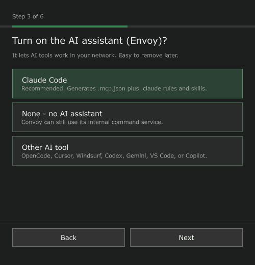
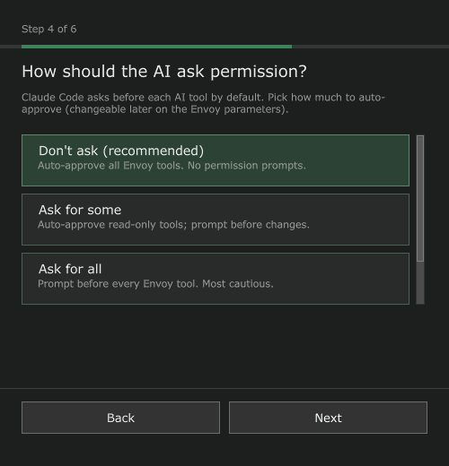

# Setup Wizard

The **setup wizard** is Embody's onboarding surface. It opens the first time you drop the Embody `.tox` into a project and walks you through the choices that matter — how much autonomy Embody gets, what to externalize, whether to turn on the AI assistant (Envoy), whether to join the trusted-LAN Convoy, and where config files are written — one decision per screen.

**Nothing changes until the final click.** Every screen up to the summary only records a selection; the summary itself says so, and only the **Set up Embody** button applies anything. Closing the wizard early (**Not now** on the first screen, or closing the window) leaves your project completely untouched.

## When it opens

- **First run** — after you drag the Embody `.tox` into a project and initialization finishes. On an upgrade, it waits until any verification dialogs have resolved, and it only appears if Envoy isn't already enabled. It never opens during a project save or a test run.
- **Re-run anytime** — pulse **Setup Wizard** (`Setupwizard`) on the Embody parameter page. The wizard reopens preset to your current settings, so you can review or change any choice without starting over.

## The steps

The wizard adapts to your answers. Conditional screens appear only when they apply, and the progress bar always reflects the current path.

### 1. Mode — how Embody manages your project

| Option | Meaning |
|---|---|
| **Auto** (recommended) | Embody manages everything on its own — git housekeeping, the Python environment, config files. |
| **Advanced** | Embody asks before touching git, your Python env, config files, or your network. Full control, minimal surprise. |

Sets the **Mode** (`Embodymode`) parameter. The choice also governs how Embody handles *later* invasive actions (a startup repair, `InitGit()` / `InitEnvoy()`), not just this setup pass.

### 2. Externalization *(only when the project still has work to externalize)*

| Option | Meaning |
|---|---|
| **New work only** (recommended) | Turns on auto-externalization for new COMPs and DATs. Nothing in the existing project is rewritten during setup. |
| **Externalize everything** | Turns on auto-externalization and, after setup, offers the separately confirmed whole-project externalization flow. A saved `.toe` is required as a recovery point. |
| **Skip for now** | Leaves externalization settings and the existing project unchanged. |

This step is skipped when the project already looks externalized. The whole-project choice keeps its own confirmation and format choice because it can touch many operators.

### 3. AI assistant — turn on Envoy?

{ width="620" }

| Option | Meaning |
|---|---|
| **Claude Code** (recommended) | Generates `.mcp.json` plus `.claude/` rules, skills, and slash commands — the fully auto-configured path. |
| **Other AI tool** | OpenCode, Cursor, Windsurf, Codex, Gemini, VS Code, or GitHub Copilot. |
| **None — no AI assistant** | Generates no AI-client config and launches no coding tool. If you enable Convoy in the next step, Embody still creates `.venv` and runs the internal local command service Convoy needs. With Convoy off, Envoy stays off. |

Envoy is easy to remove later — see [Removing Embody](getting-started.md#removing-embody).

### 4. Pick your AI tool *(only when "Other AI tool" is selected)*

Choose which client Embody generates config for: **OpenCode** (`opencode.json` plus shared `.claude/` rules and skills — see [Local Models & Open Clients](../envoy/local-models.md)), **Codex** (`AGENTS.md`), **Cursor** (`.cursor/`), **Gemini** (`GEMINI.md`), **VS Code** (MCP config), **GitHub Copilot** (`.github/`), or **Windsurf** (`.windsurf/`). Sets the **AI Client** (`Aiclient`) parameter. `AGENTS.md` is always written regardless of the client.

### 5. Permissions — how the AI asks *(Claude Code only)*

By default, Claude Code prompts before every MCP tool call. This step chooses how much Embody pre-approves in `.claude/settings.local.json`:

{ width="620" }

| Choice | Effect |
|---|---|
| **Don't ask** (recommended) | Auto-approves all Envoy tools — no permission prompts, and new tools are covered automatically. |
| **Ask for some** | Auto-approves read-only tools; anything that creates, edits, deletes, or executes still prompts. |
| **Ask for all** | Pre-approves nothing — Claude Code prompts before every Envoy tool. Most cautious. |
| **Leave settings alone** | Embody never creates or modifies `settings.local.json` — you manage permissions yourself. |

Sets the **Tool Permissions** (`Toolpermissions`) parameter, which you can change anytime without re-running the wizard. If a `settings.local.json` already exists, Embody edits only its Envoy entries and keeps everything else you've set — the wizard tells you so on this screen. See [MCP Tool Permissions](../envoy/setup.md#mcp-tool-permissions) for the full details.

### 6. Convoy — join other Embody nodes?

| Option | Meaning |
|---|---|
| **Enable Convoy** | Lets this Embody node discover, inspect, and control other Convoy-enabled siblings on the same trusted LAN, and lets those siblings address this node. |
| **Keep Convoy Off** | Leaves the node disconnected. You can enable it later on the Convoy parameter page. |

This choice sets **Enable Convoy** (`Convoyenable`). It is both the membership and exposure gate: there is no separate Create, Join, invitation, or “Expose This Node” step. Discovery and reconnect are automatic.

Convoy is independent of the AI-assistant choice. If you selected **None** and enable Convoy, Embody starts only Envoy's internal loopback command service so siblings can execute registered TouchDesigner operations. It does not generate `.mcp.json` or AI rules, connect an MCP client, or launch a coding tool.

Only enable Convoy on a LAN you trust. The wizard does **not** install or start the per-user Convoy host app; that remains a separate, locally confirmed action on the Convoy parameter page. **Allow Execute TD Python** and **Allow Full Shell** also remain off unless you enable them locally later. See the [Convoy guide](../convoy/index.md).

### 7. Git — make this project a repository? *(only when no repo was found)*

If the wizard finds no git repository above your project folder, it asks — this is your decision, not something Embody does silently:

| Option | Meaning |
|---|---|
| **Initialize Git** (recommended) | Creates a repo at the project root when you finish the wizard, then adds Embody's `.gitignore` / `.gitattributes` entries. Externalized files diff, branch, and restore best under version control. |
| **Skip for now** | No repo is created and no git files are touched. Everything else still works; add git anytime later with `op.Embody.InitGit()`. |

If a repo already exists, this screen never appears — and when an assistant is enabled, Embody adds its entries to your existing `.gitignore` / `.gitattributes` as part of setup. With no assistant, nothing is written automatically unless you initialize Git in this step; run `op.Embody.InitGit()` later to add Embody's git entries. The step is shown for **every** assistant choice, including "None": version control is the point of externalizing.

### 8. Footprint review *(Advanced mode only)*

In Advanced mode, this screen appears when an assistant is selected or Convoy-only mode needs its internal runtime. It discloses everything it is about to add before you confirm. Convoy-only setup lists `.venv`, the internal command service, and `.embody` runtime state; it does not claim that AI-client files will be generated.

- A Python environment (`.venv`) and the internal Envoy command server when an assistant or Convoy needs them
- The `.embody/` state folder
- AI-client files such as `.mcp.json` and client rules only when an assistant is selected
- Git integration and the [Embot assistant](../envoy/claude-code.md#live-build-visualization) only when their selected setup path uses them

Everything is recorded and reversible via [Uninstall](getting-started.md#the-uninstall-button). This screen also chooses where config files are written:

| Option | Meaning |
|---|---|
| **Git root** (recommended) | Config lives at the top of the git repository — right when the whole repo is your AI tool's workspace. |
| **Project folder** | Config lives next to the `.toe` — use when the `.toe` sits in a subfolder you open as your workspace. |
| **Custom folder** | A folder picker opens when you finish the wizard. |

Sets the **AI Project Root** (`Aiprojectroot`) parameter. In Auto mode this screen is skipped and the git-root default is used — you can change it later; see [Configuration — AI Project Root](configuration.md#envoy).

### 9. Summary

A recap of your mode, externalization, assistant, Convoy, and (when asked) git choices, with the reminder that nothing has changed yet. **Set up Embody** applies it all.

## What "Set up Embody" does

Most choices apply in one pass after the final click. **Externalize everything** is the deliberate exception: it opens its own whole-project confirmation and format choice before changing existing operators.

1. **Persists your choices** to the corresponding parameters (Mode, AI Client, Tool Permissions, AI Project Root, auto-externalization, and Convoy when those steps were shown).
2. **Applies your git choice.** If you chose **Initialize Git**, the repo is created first (with Embody's `.gitignore` / `.gitattributes` entries), so config lands inside it. If you chose **Skip for now** — or a repo already existed — config files are generated either way; a failed or skipped init never blocks setup, and `op.Embody.InitGit()` adds git integration later.
3. **Applies the externalization choice.** New-work mode changes only the auto-externalization preference. Whole-project mode opens its own confirmation and format choice after setup; it never silently rewrites the project.
4. **If you chose None with Convoy off**: Envoy stays off and you're set up for externalization only.
5. **If you chose None with Convoy enabled**: Embody enables only Envoy's internal loopback command substrate. Dependencies install in a background thread, but no AI client is configured or launched.
6. **If you chose an assistant**: AI config files are generated, the MCP server starts on the configured port, and dependencies install in a background thread — TouchDesigner stays responsive. The independent Convoy choice is applied either way; enabling Convoy here does not install its host app. See [Envoy Setup](../envoy/setup.md) and [Convoy Setup](../convoy/host-app.md).
7. **On a re-run** with Envoy already running, the command server restarts so a new port, root, or client takes effect. AI config is regenerated only when an AI client is selected.

## Changing your mind later

Every wizard choice maps to a parameter you can change directly, no wizard required:

| Wizard step | Parameter | Page |
|---|---|---|
| Mode | **Mode** (`Embodymode`) | Embody |
| Externalization | **Auto-Externalize New Ops** (`Autoexternalize`) or the manual project externalization action | Embody |
| AI assistant on/off | **Envoy Enable** (`Envoyenable`) | Envoy |
| AI tool | **AI Client** (`Aiclient`) | Envoy |
| Permissions | **Tool Permissions** (`Toolpermissions`) | Envoy |
| Convoy membership | **Enable Convoy** (`Convoyenable`) | Convoy |
| Git | `op.Embody.InitGit()` (no parameter — a one-time action) | — |
| Config location | **AI Project Root** (`Aiprojectroot`) | Envoy |

See the [Parameter Reference](parameters.md) for all of them. To remove what setup added, use [Uninstall](getting-started.md#removing-embody).

!!! note "Fallback dialog"
    In builds where the wizard UI isn't available (older or headless builds), Embody falls back to a simple two-button **"Enable Envoy?"** dialog covering the same decision.
