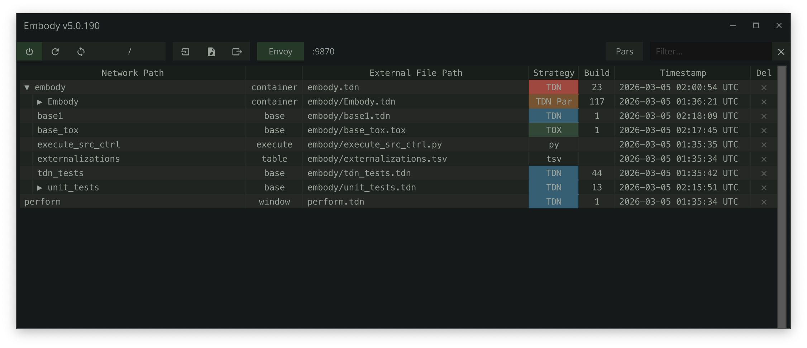

# web/ — embody.tools landing page

A static landing page for [embody.tools](https://embody.tools). Three files,
no build step, no dependencies, no `node_modules`. Open `index.html` in any
browser to see it. Drop the whole `web/` folder into any static host to ship it.

This is *separate* from the MkDocs documentation site under `docs/` — the docs
site lives at `dylanroscover.github.io/Embody/`, this lives at `embody.tools`.
Two surfaces, two purposes: docs informs, landing sells.

## Files

```
web/
├── index.html      ← the page (~17 KB)
├── styles.css      ← all styles (~17 KB)
├── README.md       ← you are here
└── assets/
    └── embody-screenshot.png   ← copied from docs/assets/, do not edit in place
```

That's it. There is no JavaScript file. The page works fully with JS disabled.

## Deploy

Pick whichever is easiest. All three options assume you've decided how DNS for
`embody.tools` is going to point at the host.

### Option A — Cloudflare Pages (recommended for the embody.tools domain)

1. New Pages project → connect this repo
2. Build settings:
   - Framework preset: **None**
   - Build command: *(leave empty)*
   - Build output directory: `web`
3. Custom domain: `embody.tools`
4. SSL: automatic

Cloudflare gives you global CDN, free SSL, and instant cache invalidation on
push. The page is plain static HTML so there's nothing to build.

### Option B — GitHub Pages

If you'd rather keep deployment in-repo:

1. Settings → Pages → Source: `Deploy from a branch` → branch `main` → folder `/web`
2. Custom domain: `embody.tools` (add a `web/CNAME` file containing the single
   line `embody.tools` if you want the domain wired up declaratively)

The downside: GitHub Pages serves from `/web/` as the site root, so all relative
links will work. But mixing the docs site (already at `dylanroscover.github.io/Embody/`)
with the landing page in the same repo means you can only have one Pages source.
If the docs site is currently published from gh-pages branch or `/docs/`, this
option will conflict — Cloudflare Pages avoids that.

### Option C — Netlify drop

For the laziest possible deploy: drag the `web/` folder onto
`app.netlify.com/drop`. Done in 30 seconds, custom domain configurable from the
dashboard.

## Things you may want to edit before launch

These are the lines I'd check first as a designer-by-trade who'll pixel-fuck
everything. Each one is intentional but each is also a *choice*.

### 1. The placeholder city in the footer
`index.html` line ~333:
```html
<p class="footer__sig">made with too much caffeine in <span class="footer__city">los angeles</span></p>
```
I defaulted to `los angeles` and `made with too much caffeine` to mirror
owlette's `made with 🎤 in california` register. If you'd rather use a real
emoji + place, that's the slot. The `<span class="footer__city">` is so the
city color stays slightly brighter than the rest of the line.

### 2. The hero CTA target
`index.html` line ~70:
```html
<a class="btn btn--primary" href="https://github.com/dylanroscover/Embody/tree/main/release">
```
This points to the `/release` directory listing on GitHub. Once you cut a
proper GitHub Release with the `.tox` as an asset, change this to
`https://github.com/dylanroscover/Embody/releases/latest` so visitors land on
the newest tagged release instead of a folder listing.

### 3. The Open Graph meta tags assume embody.tools is live
`index.html` lines 13–14, 21:
```html
<meta property="og:image" content="https://embody.tools/assets/embody-screenshot.png" />
<meta property="og:url" content="https://embody.tools/" />
<meta name="twitter:image" content="https://embody.tools/assets/embody-screenshot.png" />
```
These are absolute URLs because OG/Twitter crawlers don't resolve relative
paths. **They will only generate working previews once embody.tools is
serving this page.** Until then, social shares will show a broken image. If
you need to launch on a different host first, swap the `https://embody.tools/`
prefix to whatever host is live.

### 4. The hero screenshot vs. demo video slot
`index.html` line ~78:
```html
<figure class="hero__shot">
  
  <figcaption class="hero__shot__caption">Demo video coming soon — until then, here's the manager UI.</figcaption>
</figure>
```
The hero is structured so a `<video>` element can swap in cleanly when you've
recorded the demo. Replace the `` with:
```html
<video autoplay muted loop playsinline poster="assets/embody-screenshot.png">
  <source src="assets/demo.mp4" type="video/mp4" />
  <source src="assets/demo.webm" type="video/webm" />
</video>
```
…and update the figcaption to match (or delete it). The CSS already targets
`.hero__shot img` for the border + radius + shadow — you'll need to copy
those styles to `.hero__shot video` (one extra line, or just change `img` to
`img, video` in `styles.css` line ~300).

### 5. The favicon
Currently an inline SVG data URI: green dot on dark square. If you'd rather
ship a real favicon, drop `favicon.png` (32×32 or 64×64) into `web/assets/`
and replace the `<link rel="icon" ...>` block at the top of `index.html`
with `<link rel="icon" type="image/png" href="assets/favicon.png" />`.

## How the page is structured

If you want to tweak something, here's the section order with line ranges so
you can jump straight to it:

| Section | HTML | CSS |
|---|---|---|
| Sticky mark (top-left logo) | ~38–50 | ~6: Mark (~199–234) |
| Hero | ~54–88 | ~7: Hero (~237–315) |
| Three pillars (Envoy / Embody / TDN) | ~91–125 | ~8: Pillars (~318–358) |
| In Practice (chat-style list) | ~127–162 | ~9: Practice (~361–398) |
| Meet TDN | ~164–225 | ~10: TDN section (~401–499) |
| Get Started (4 steps) | ~227–268 | ~11: Steps (~502–573) |
| Manifesto pull quote | ~270–287 | ~12: Pullquote (~576–599) |
| Footer | ~292–335 | ~13: Footer (~602–685) |

The CSS is divided into 15 numbered sections with `------` comment dividers so
you can find anything fast. Section 1 is the design tokens (`--bg`, `--accent`,
etc.) — change a token and it propagates everywhere.

## Color tokens (so you don't have to dig)

```css
--bg:            #181e1e   /* dominant background */
--bg-elevated:   #1f2321   /* cards, code blocks */
--bg-elevated-2: #283028   /* hover states */
--bg-code:       #161e1a   /* inline code pills */
--text:          #c8d0c9   /* body text */
--text-muted:    #97a098   /* secondary text */
--text-faint:    #6b756c   /* tertiary, captions */
--accent:        #6ee668   /* primary green — CTA, links, eyebrows */
--accent-hover:  #a0f09c   /* accent hover */
--border:        #2a4a42   /* visible borders */
--border-faint:  #283028   /* subtle dividers */
```

These match the existing Embody UI palette in TouchDesigner — the dark green
register comes directly from `docs/stylesheets/extra.css`, not from anything
invented for the landing page. So if you tweak the live UI's colors in TD,
you can mirror them here in two minutes.

## Type

- **Headings**: Inter 600 from Google Fonts (one weight, one import).
- **Body**: system-ui stack — fastest possible, looks correct on every OS.
- **Mono**: JetBrains Mono → SF Mono → Menlo → Consolas fallback chain. No
  webfont loaded for mono — every system has something acceptable.

If you want a different mono webfont, add it to the `<link>` at the top of
`index.html` and update `--font-mono` in `styles.css` line ~34.

## Accessibility notes

- Page works fully with JavaScript disabled
- Reduced-motion media query respects `prefers-reduced-motion`
- Keyboard focus rings via `:focus-visible` (only show for keyboard users,
  not mouse clicks)
- All interactive elements have `aria-hidden` set on decorative SVGs
- Color contrast on body text vs. background passes WCAG AA at 17px

The single accessibility gap I'd flag: the JSON code block in the TDN section
uses hand-rolled `<span>` colors for syntax highlighting. Screen readers will
read the entire block as one long string of punctuation — fine for sighted
users, suboptimal for SR users. If you want to fix that, add
`aria-label="Sample TDN file showing operators, parameters, and annotations"`
to the `<pre>` (which it already has) and consider hiding the spans from AT
with `aria-hidden="true"` on the inner `<code>`. Out of scope for v1.

## What's NOT here (intentional omissions)

These came up during design critique and were deliberately left out to keep
v1 tight. If you decide later you want any of them, they're additive:

- **No FAQ section.** Owlette has one. Embody doesn't yet — the manifesto
  link does the depth-of-context job for now. If you want one, the rhythm
  fits between the manifesto teaser and the footer.
- **No "without Embody / with Embody" comparison.** The implicit wedge
  against TWOZERO is in the pillar copy and the manifesto. A literal
  comparison table would name a competitor and dignify them.
- **No GitHub stars badge.** Would require build-time injection or runtime
  fetch. The "open source · MIT" eyebrow does the same job statically.
- **No newsletter signup.** Don't.
- **No analytics.** Add Plausible or Fathom if you want light tracking.
  Don't add Google Analytics.

## Updating from the docs site

The screenshot at `web/assets/embody-screenshot.png` is a *copy* of
`docs/assets/embody-screenshot.png`. If you update the canonical screenshot
in `docs/`, copy it over:

```bash
cp docs/assets/embody-screenshot.png web/assets/embody-screenshot.png
```

There's no automatic sync. Keeping it as a copy avoids cross-folder relative
paths breaking when the page is deployed.

## TL;DR for shipping

1. Decide host (Cloudflare Pages recommended)
2. Edit the footer city if you don't want LA
3. Wait for `embody.tools` to point at the host
4. Push to main, deploy
5. Test the OG preview at <https://www.opengraph.xyz/url/https%3A%2F%2Fembody.tools>

That's it. The page is done.
